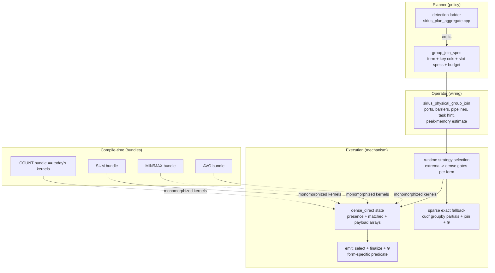
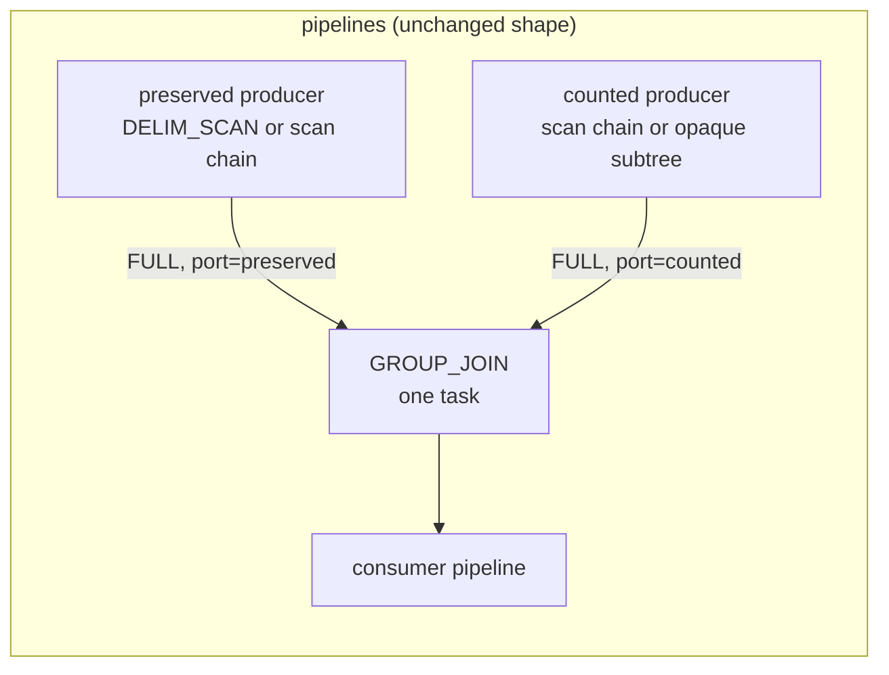

# GROUPJOIN Operator Framework — Design

**Status:** draft for review — design only, no code
**Scope:** generalize `DENSE_COUNT_JOIN` into a generic fused join+group-by (GROUPJOIN) framework
**Baseline:** branch `perf/dense-count-join` @ `db7bcb3c`
**Papers:** Moerkotte & Neumann, PVLDB 4(11) 2011 ("M11"); Fent & Neumann, PVLDB 14(11) 2021 ("F21")

---

## 1. Executive summary

Sirius already ships one fused join+aggregate operator: `DENSE_COUNT_JOIN` fuses
`COUNT(col|*) … GROUP BY key` over a preserved-side outer equi-join into a single two-input,
single-task operator built on direct-address histograms
(`src/op/sirius_physical_dense_count_join.cpp`, `src/cuda/dense_count_join_impl.cu`). It replaces
a ~6-pipeline join+aggregate fragment with 3 pipelines and one GPU task, and it is default-on.

This document generalizes that operator into a **GROUPJOIN framework** decomposed into five
orthogonal axes — aggregate bundle, join form, key-domain strategy, empty-group/NULL semantics,
and result consumption — such that:

1. The existing COUNT pathway lowers to **byte-identical kernels and identical pass/allocation
   structure** (§7, performance preservation argument). Templates monomorphize; nothing virtual
   touches the hot loop.
2. Two new TPC-H pathways land on the v1 mechanism: **q17** (AVG per delim partkey, true
   groupjoin over an INNER correlation join; fused with preserved-port dynamic-filter
   publication as a prerequisite, §4.9/§5.1) and **q2** (MIN per partkey, a degenerate
   single-input "DIRECT" form of the same operator — by its own gates it runs the *sparse*
   strategy inside the single fused task; the win is the fragment collapse, §5.2). A third,
   **q18** (SUM per orderkey with functionally-determined carried columns), is fully specified
   but scheduled behind the explicitly-designed sparse/remap seam (§5.4).
3. Everything else — DISTINCT aggregates, composite keys, arbitrary sparse domains, semi/anti
   membership, multi-GPU — is a named seam or a named non-goal (§8). Streamed accumulation,
   originally a named seam, is specified as the `BUILD_STREAM` schedule (§4.8.1, PR-5).

The theoretical foundation is deliberately **not** the papers' groupjoin operator itself but
their both-sides eager-aggregation identity (M11 Eq 13/18 with the Yan–Larson ⊗ correction):
Sirius computes `Γ_G(e1 ⋈ e2)` directly as *two independent per-key aggregations combined in a
shared dense index*, which eliminates the papers' duplicate-free-left-side precondition for
every aggregate we support (§2.3). This keeps detection statistics-free and cheap, exactly as
today.

---

## 2. Theory background (load-bearing results only)

### 2.1 Decomposable / splittable aggregates and the ⊗ correction (M11 §2, Fig. 1)

An aggregate is *decomposable* if partial aggregates merge losslessly: min/min, max/max,
count→sum, sum→sum, avg = (sum, count-of-non-NULL). An aggregation vector is *splittable* if
each component references only one join side. Both are prerequisites for computing aggregates
before/independently of a join. The **⊗ correction** (Yan–Larson, M11 §1.5 as reproduced in the
paper's definitions): when a per-key aggregate computed on one side is combined with the other
side's per-key multiplicity `c`, duplicate-*sensitive* aggregates scale — `sum(e)→sum(e)·c`,
`count(*)→c·matched` — while duplicate-*agnostic* aggregates (min, max) are unchanged, and AVG
is invariant because `c` cancels in numerator and denominator.

Today's operator already **is** an ⊗ implementation: `presence[k] × matched[k]`
(`emit_kernel`, `src/cuda/dense_count_join_impl.cu:163-189`) is exactly `count(*)⊗presence`.

### 2.2 The two rewrites and the COUNT bug (M11 Eq 9–12; F21 §2.1, Table 1)

- **Outer form** (M11 Eq 11): `Γ_G(e1 LOJ e2) ≡ groupjoin` requires condition (4):
  `F(∅) = F({⊥})` — true for min/max/sum/count(col), **false for count(*)**. SQL
  LOJ-then-GROUP-BY gives an unmatched left row count(*) = 1 (the NULL-padded row counts),
  count(col) = 0, sum/min/max = NULL. A naive fused operator that evaluates `agg(∅)` returns
  count(*) = 0 — the COUNT bug. The fix is a per-aggregate empty-group default (M11 Eq 18's
  `c2:1` LOJ default). Today's kernel implements it: `if (count_star && matched == 0) matched = 1`
  (`dense_count_join_impl.cu:180`).
- **Inner form** (M11 Eq 12): `Γ_G(e1 ⋈ e2) ≡ Π(σ_{c2>0}(groupjoin computing c2:=count(*)))`.
  No empty-group condition needed; the operator must always carry a per-key match count and
  filter `matched > 0`. This maps to a one-line change in the emit selection predicate.

### 2.3 Why Sirius does not need the duplicate-free precondition

The papers' groupjoin emits one row per left tuple, so duplicates on the left silently break the
rewrite (M11 Appendix E, counterexample 3). Sirius's operator instead computes the **group-by
result directly** when the group key *is* the join key: it materializes
`presence = Γ_key(count(*))(preserved)` and `partials = Γ_key(F¹ ∘ count(*))(counted)` into a
shared dense index and combines them with ⊗ at emit. This is M11 Eq 13/18 (both-sides eager
aggregation) specialized to `G = J1 = J2`, under which preconditions 1–2 of Eq 11/12 hold
*structurally* and left-side duplicates are handled by the ⊗ scaling itself — no FD reasoning,
no uniqueness proof, no statistics. Framework conditions that remain and must be enforced by
detection:

- aggregates reference only the counted side (splittability, M11 cond 3);
- aggregates are decomposable (COUNT/SUM/MIN/MAX/AVG per M11 Fig. 1 — all of ours);
- the group key equals the preserved-side join key (makes `G2⁺ = J2` trivial);
- empty-group defaults per §2.2 for the outer form.

FD-based generalizations — key shrinking (M11 Eq 4/6/7) and carried determined columns — are
needed only for the q18-class pathway and are explicitly deferred (§5.4).

### 2.4 Strategy economics: the eager-aggregation hazard (F21 §3, Table 3)

F21's cost model: eager right aggregation costs `|S|` and only wins when nearly every counted
tuple joins (σ_S ≈ 1, e.g. q13 with σ_S = 100%). When σ_S ≪ 1 (q17: |R| = 204 vs |S| = 6M at
SF1, σ_S = 0.10%), eager is **an order of magnitude slower** than join-filtered aggregation.
This matters directly to us: our *sparse fallback* (`cudf::groupby` partials over the whole
counted side, `sirius_physical_dense_count_join.cpp:551-651`) **is** eager right aggregation.
It is the correct backstop for q13-shaped inputs and a hazard for q17-shaped ones. §4.4's gate
policy is designed around this asymmetry.

### 2.5 Non-results we deliberately do not import

- F21's three parallel strategies target CPU cache-contention; GPU hardware atomics on dense
  arrays already give contention-free accumulation, and the dense histogram supports concurrent
  accumulation from many tasks with zero merge logic (load-bearing for the streamed schedule,
  §4.8.1).
- F21 §4's skew-normal aggregate estimates require a stats subsystem Sirius does not have;
  DuckDB's `estimated_cardinality` plus stats-free runtime gating (today's approach) suffices
  for our gate ladder.
- M11's Q9 lesson — a rewrite applied locally can lock out a better join order — is accepted
  risk: we pattern-match DuckDB's already-optimized plan and mitigate with fail-closed gates
  and per-pathway measurement, not with join-order enumeration.

### 2.6 Related systems

Neither DuckDB, Velox, nor DataFusion ships a fused groupjoin physical operator; the production
precedents are Umbra/HyPer (F21) and System T (M11). DuckDB's closest analogue is
`PhysicalPerfectHashAggregate` (dense-domain direct addressing for group-by), whose eligibility
probe Sirius already mirrors at `src/planner/sirius_plan_aggregate.cpp:512-606`. That precedent
informs the DIRECT form (§4.3) but the join-fused forms have no OSS reference implementation —
the dense-count operator itself is the reference.

---

## 3. Dense count join today (verified anatomy)

The full anatomy is in the operator sources; this section pins the facts the framework must
preserve or generalize, with verified anchors.

**Planner.** Hook: `create_plan(LogicalAggregate&)` runs `downcast_hugeint_types` (:632), then
`try_plan_dense_count_join` (`src/planner/sirius_plan_aggregate.cpp:640`), before any generic
aggregate planning. Detection `detect_dense_count_join` (:242-360): exactly 1 group (BOUND_REF)
= preserved-side join key (:328-337); exactly 1 aggregate that passes the paranoid
builtin-COUNT catalog identity check `exact_builtin_count_id` (:195-240); no
DISTINCT/FILTER/ORDER BY (:261); child is `LOGICAL_COMPARISON_JOIN` LEFT/RIGHT with one
COMPARE_EQUAL condition on BOUND_REFs, no residual predicate (:268-303); keys both INTEGER or
both BIGINT (:313-317); projection maps and output types re-validated (:279-297 via
`validate_join_projection_layout` :143-158 and `resolve_join_output_column` :160-173); both
children linear GET/FILTER/PROJECTION scan chains (`is_linear_scan_chain` :176-191); COUNT(col)
argument resolves to the counted side (:348-358). **No statistics are consulted.** Construction
(:364-418) captures child cardinalities before `create_plan` drains them and emits the operator
with `op_params.dense_count_join_max_bytes`.

**Operator.** `sirius_physical_dense_count_join` is source+sink
(`src/include/op/sirius_physical_dense_count_join.hpp:80-81`) with named FULL-barrier ports
"preserved"/"counted" (hpp:60-61). Port/barrier policy is per-operator virtuals
`input_port_for`/`input_barrier_for` (`sirius_physical_dense_count_join.cpp:287-304`) consumed
generically by the converter (`src/pipeline/sirius_pipeline_converter.cpp:211-218`).
`build_pipelines` (:306-328) collapses the fragment to 3 pipelines; `get_next_task_hint`
(:330-343) waits for both producers and fires exactly one task; `get_next_task_input_data`
(:345-363) drains both ports into a side-tagged `dense_count_join_input`. Excluded from
terminal-sink merge fusion (`src/planner/sirius_physical_plan_generator.cpp:858`). Output schema
hard-coded `[key, BIGINT]` (ctor :272-276).

**Execution.** `execute` (:411-661): per-batch column harvesting with checked row accounting
(:460-488); `dense_count_global_minmax` (`dense_count_join_impl.cu:395-443`) — per-batch
`cudf::minmax` merged on-device by 1-thread kernels, **one unconditional stream sync** for the
extrema readback (:441). Dense gate `dense_ok` (:515-525): layout-valid range; range ≤
budget/(2·slot_bytes) with 2 GiB default; range ≤ 8× non-null preserved rows; range ≤ 2× total
rows; histogram bytes ≤ 4× input logical bytes. Slots are uint32 unless a side ≥ 2^32 rows
(:510-512). Dense path: two zeroed histograms (`dense_count_state` ctor, impl.cu:445-469);
grid-stride `accumulate_kernel` (impl.cu:126-155; 256-thread blocks, ≤4096 blocks, :51-59) —
preserved side unchecked, counted side bounds-checked, NULL keys/args skipped via masks; emit =
`thrust::count_if`/`copy_if` over the range with `rmm::exec_policy(stream, mr)` (impl.cu:331)
plus `emit_kernel` writing `key = min + slot`, `value = presence × matched` with the count(*)
empty-group fix (:163-189); overflow validated on-device only when the host coarse bound
`count_product_needs_validation` (.cpp:107-116) is inconclusive (impl.cu:344-380). NULL
preserved keys become one appended NULL-group row (impl.cu:263-313). Sparse fallback:
per-batch `cudf::groupby` COUNT partials widened to INT64 (.cpp:119-139), balanced pairwise
merges (:169-198), `cudf::left_join` with `null_equality::UNEQUAL` of the distinct-key tables,
`presence × matched` (:551-651).

**Memory/config.** `no_history_peak_memory_estimate` (:365-409) with saturating arithmetic;
OOM retry-reservation floor (`src/include/pipeline/gpu_pipeline_task.hpp:93-130`). Knobs:
`enable_dense_count_join` default true (`src/include/sirius_config.hpp:101,186`);
`dense_count_join_max_bytes` engine-owned 2 GiB (hpp:103,189) — the YAML key throws
(`src/sirius_config.cpp:299-303`), surviving only as an internal test-hook SQL setting.
Compressed-materialization arms: `src/planner/sirius_plan_narrowing_policy.cpp:439-457` (keys
`boundary_restore`, COUNT arg stays narrow, no forwarded carrier) and
`src/planner/sirius_plan_compressed_schema.cpp:392-410` (native keys, no output sidecar).

**Perf invariants** (must survive the refactor; see §7): single task, one unconditional sync,
one histogram pass per batch per side + 2 range passes + 1 emit, the unchecked-preserved /
checked-counted asymmetry, 32-bit slot preference, the four dense gates with their constants,
256/≤4096 launch geometry, the exact allocation set, balanced sparse merge, cheap-first
stats-free gating, estimate↔allocation agreement, `min + slot` key emission with no gather.

---

## 4. Framework design

### 4.1 Axes and roles



Policy (which shapes fuse, which budgets apply, which semantics hold) lives entirely in the
planner spec and in per-form gate tables; mechanism (histograms, atomics, selection, emission)
is shared and parameterized by compile-time bundles. Nothing on the device hot path dispatches
dynamically.

### 4.2 Axis A — aggregate specification

**Planner-side spec (runtime values, policy):**

```cpp
namespace sirius::op::groupjoin {

enum class join_form : uint8_t {
  OUTER_PRESERVING,  // today's LEFT/RIGHT: emit every present group (COUNT bug semantics apply)
  INNER,             // M11 Eq 12: emit iff presence > 0 && matched > 0
  DIRECT             // single input, plain GROUP BY semantics (NULL key is a group)
};

enum class agg_op : uint8_t { COUNT_STAR, COUNT_VALID, SUM, MIN, MAX, AVG };

struct slot_spec {
  agg_op op;
  std::optional<std::size_t> arg_idx;   // counted-side column; nullopt for COUNT(*)
  sirius::logical_type output_type;     // declared result type (drives finalize + widening)
};

struct group_join_spec {
  join_form form;
  std::size_t preserved_key_idx;        // unused for DIRECT
  std::size_t counted_key_idx;
  duckdb::vector<slot_spec> slots;      // v1 detection emits exactly one; mechanism takes N
  uint64_t max_state_bytes;             // engine-owned, per-form (§4.7)
};

}  // namespace sirius::op::groupjoin
```

**Kernel-side policy (compile time, mechanism).** Each `agg_op` maps to a *slot policy* — the
device-side accumulator — constrained by a concept so bundles are checked at compile time and
inheritance never reaches the loop:

```cpp
template <class P>
concept slot_policy =
  std::is_trivially_copyable_v<typename P::slot_type> &&
  requires(typename P::slot_type* s, typename P::arg_type v) {
    { P::init_fill } -> std::convertible_to<slot_init>;   // ZERO_MEMSET or VALUE_FILL
    { P::update(s, v) } -> std::same_as<void>;            // __device__ atomic RMW
  };

// Exemplars (device code in group_join_impl.cu):
template <class CountT> struct count_slot {          // == today's histogram_add (impl.cu:118-124)
  using slot_type = CountT; using arg_type = no_arg;
  static constexpr slot_init init_fill = slot_init::ZERO_MEMSET;
  __device__ static void update(slot_type* s, no_arg) { histogram_add(s); }
};
struct sum_slot_i64 {                                 // SUM/AVG numerator (unscaled decimals too)
  using slot_type = int64_t; using arg_type = int64_t;
  static constexpr slot_init init_fill = slot_init::ZERO_MEMSET;
  __device__ static void update(slot_type* s, int64_t v) { atomicAdd(/*ull*/ s, v); }
};
struct min_slot_i64 {                                 // init = INT64_MAX via thrust::fill
  using slot_type = int64_t; using arg_type = int64_t;
  static constexpr slot_init init_fill = slot_init::VALUE_FILL;
  __device__ static void update(slot_type* s, int64_t v) { atomicMin(s, v); }
};
```

**Bundles.** A bundle is the fixed tuple of arrays one accumulate pass updates. Whitelisted
instantiations (explicit-instantiation list in the `.cu`; no combinatorial template explosion):

| bundle | arrays (all length `range`)                                | per-row device work (counted pass) |
|---|---|---|
| COUNT  | `matched:CountT`                                           | 1 atomicAdd — **today's kernel** |
| SUM    | `matched:CountT`, `sum:int64`                              | 2 atomics |
| MIN/MAX| `matched:CountT`, `extreme:int64`                          | 1 atomicAdd + 1 atomicMin/Max |
| AVG    | `matched:CountT`, `sum:int64`                              | 2 atomics |

plus `presence:CountT` for the two-input forms (preserved pass — identical kernel for every
bundle, i.e. exactly today's `accumulate_preserved`, impl.cu:471-482). `matched` is mandatory in
every bundle: it is M11 Eq 12's intrinsic `c2` (INNER emit filter), the ⊗ multiplier input, and
COUNT's own value. When the aggregate argument is nullable those are **different quantities**
(today's kernel skips NULL-arg rows via the value mask, impl.cu:145-147, so a single `matched`
array would count valid-arg rows, not key matches). v1 does not carry two counts; it makes them
provably equal:

**Argument-validity gate (dense precondition, value bundles and COUNT(col) on INNER/DIRECT):**
the dense strategy is selected only if the argument column reports `null_count() == 0` across
every harvested counted batch — known before state allocation in the one-shot schedule
(`execute_inner_direct` harvests all batch views first,
`sirius_physical_group_join.cpp:1408-1454`, null accounting :1445-1447) at metadata cost. The
streamed schedule cannot inspect batches it has not seen before allocating; it replaces this
runtime gate with a plan-time NOT-NULL proof plus a per-batch belt-check (§4.8.1). Under the gate,
per-key valid-arg count ≡ key-match count ≡ `c2`, so one `matched` array is simultaneously the
INNER emit filter, the ⊗ input, COUNT(col)'s value, and AVG's divisor — and AVG needs no
separate `valid_cnt` array at all. Any NULL argument (organic, or padding from an outer join
inside a DIRECT child, §4.5) routes the whole task to the **sparse mask-preserving strategy**
(§4.4), which is exact for nullable arguments. A separate-`c2`-plus-valid-count dense state is a
named seam, unbuilt until a pathway needs it. All named TPC-H pathway columns (l_quantity,
ps_supplycost) are NOT NULL, so the gate never fires on them.

**Init, finalize, overflow — per-op policy table (the rest of axis A):**

| op | slot init | emit finalize | empty-group value (OUTER) | overflow policy |
|---|---|---|---|---|
| COUNT(col) | memset 0 | `presence × matched` (valid ≡ matched under the argument-validity gate) | 0 | today's: host coarse bound (.cpp:107-116) → device flag (impl.cu:182-186) |
| COUNT(*) | memset 0 | `presence × max(matched,1)` | presence (≥1) | same |
| SUM | memset 0 | `presence × sum`, cast to declared type (DECIMAL64→128 as `gpu_aggregate_impl.cpp:420-435` does) | NULL (v1: form excluded, §4.5) | host bound `counted_rows × max(abs(vmin), abs(vmax))` from value extrema folded into the single sync; inconclusive ⇒ decline dense → sparse (parity with generic GPU int64 accumulation). One-shot schedule only — streamed specs prove the bound at plan time instead (§4.8.1) |
| MIN/MAX | fill sentinel | raw slot; validity = `matched>0` | NULL (v1: excluded) | none needed |
| AVG | memset 0 | `DIV(sum, matched)` (divisor ≡ valid count under the gate) — reuse the finalize construction of `sirius_physical_grouped_aggregate_merge.cpp:259-284` (DECIMAL fixed-point vs FLOAT64) | NULL (v1: excluded) | as SUM |

AVG needs no ⊗ multiply — presence cancels (§2.1). SUM/COUNT do (`presence × …`), MIN/MAX are
duplicate-agnostic and take the raw slot. Finalization for AVG happens on the emitted
`num_groups`-sized columns via one `cudf::binary_operation` — reuse over re-implementation; at
group cardinalities (≤ a few hundred K for every pathway) this is noise.

Argument types v1: INT32, INT64, DECIMAL32, DECIMAL64 (accumulated as unscaled int64 —
`sum_slot_i64` — with declared-type cast at emit). No FLOAT v1 (no pathway; atomicAdd(double)
is a one-line seam).

### 4.3 Axis B — join-form subset

Supported forms and why:

| form | semantics | needed by | emit selection predicate |
|---|---|---|---|
| `OUTER_PRESERVING` | LEFT/RIGHT outer, preserved = group side; SQL LOJ+GROUP BY semantics incl. the COUNT bug fix | q13 (existing) | `presence > 0` (today's `presence_positive`, impl.cu:157-161) |
| `INNER` | M11 Eq 12; the fused histogram **is** the join | q17 (and q20/q18 later) | `presence > 0 && matched > 0` |
| `DIRECT` | no join; single counted input; plain GROUP BY over an arbitrary subtree — the degenerate case where the presence side is provably redundant | q2 | `matched > 0`; NULL keys form a real group (extra slot, §4.5) |

Excluded, with one-line justifications:

- **SINGLE** — Sirius hash join already rejects it (`docs/super-sirius/operators.md:249-262`);
  no pathway.
- **SEMI/ANTI/MARK** — membership, not aggregation. The q4/q22 dense-membership bitmap is a
  worthwhile *sibling* operator (19 MB custkey bitmap at SF1000) hooking at the delim join, not
  at the aggregate; it shares the domain machinery but nothing of the aggregate axes. Out of
  scope here; the domain-strategy interface (§4.4) is written so it can be reused.
- **FULL OUTER** — no pathway; both-sides-preserved semantics would need a second NULL-group
  mechanism for unmatched counted keys.
- **IS NOT DISTINCT FROM keys** — every identified correlation join under an aggregate uses
  plain `=` (q17: `l_partkey = p_partkey`); INDF appears only at the delim-join level above,
  which we do not fuse. Seam: an `null_safe_keys` flag in the spec would change only the NULL
  handling rows of §4.5.

DIRECT is included rather than left to the generic aggregate because (a) it falls out of the
axes for free — it is the two-input mechanism with the presence array and its pass deleted;
(b) it is the *honest* formulation of q2, where a true groupjoin at either join edge is invalid
or a pessimization (§5.3); (c) gating it to join-rooted single-key shapes keeps it from
re-litigating general aggregation planning (the perfect-hash probe territory,
`sirius_plan_aggregate.cpp:512-606`).

### 4.4 Axis C — key-domain strategy

**v1 strategy: `dense_direct`** — today's mechanism unchanged: runtime extrema
(`dense_count_global_minmax`), `offset = (u64)key − (u64)min` (impl.cu:149-152), direct-address
arrays, `min + slot` key reconstruction at emit (no gather). Generalizations:

- `combined_slot_bytes` generalizes from `2 × slot` to `Σ` over the form's array set (presence?
  + matched + payloads). All budget math keys off this sum.
- **Per-array count widths (new forms only).** Today's rule promotes *both* count arrays to
  64-bit when *either* side ≥ 2^32 rows (.cpp:510-512) — correct because a per-key count is
  bounded only by its side's row count, but wasteful when the sides are asymmetric. New forms
  derive each width from its own bound: `presence` is u32 iff preserved rows < 2^32, `matched`
  is u32 iff counted rows < 2^32; payload arrays (`sum`, `extreme`) are always 64-bit. Same
  proof shape as today (per-key count ≤ side rows), no saturation flag needed. The COUNT bundle
  (P0) keeps the joint promotion rule **verbatim** as part of the R1 guarantee (§7.3). Concrete
  consequence: q17 at SF1000 unfiltered (counted lineitem ~6 B rows ≥ 2^32, preserved ~540 K)
  gives presence:u32 + matched:u64 + sum:i64 = 20 B/slot, not the joint-rule 24 B/slot that
  would bust the budget; when the preserved-port membership filter (§4.9) collapses the counted
  side below 2^32 rows, the runtime derivation yields 16 B/slot automatically.
- Value extrema (needed by SUM/AVG overflow bounds) merge into the same device extrema array
  (2 slots → 2 + 2·num_sum_slots) and are read back **in the same single memcpy/sync**
  (impl.cu:436-441). The count bundle keeps a 2-slot array and identical kernels. One-shot only:
  a streamed build sees no counted batches, so STREAM keeps the 2-slot key-extrema pass and moves
  the SUM/AVG bound to a plan-time proof (§4.8.1).

**Gate policy is per-form** (the load-bearing policy/mechanism split):

| gate (today's letter, .cpp:515-525) | COUNT / OUTER_PRESERVING | INNER (delim-provenance) / DIRECT value forms |
|---|---|---|
| (a) layout valid (range ≠ 0, ≤ SIZE_MAX/slots, ≤ INT64_MAX) | unchanged | unchanged |
| (b) state ≤ budget | `dense_count_join_max_bytes` = 2 GiB, unchanged | `group_join_max_state_bytes`, engine-owned `min(16 GiB, device memory / 16)` (§4.7) |
| (c) range ≤ 8 × non-null preserved rows | unchanged | **dropped** |
| (d) range ≤ 2 × total rows | unchanged | unchanged |
| (e) state bytes ≤ 4 × input logical bytes | unchanged | unchanged |

Rationale for dropping (c) on the new forms: gate (c) prefers sparse when the histogram is much
larger than the live key set. For COUNT shapes that is right — the sparse path aggregates a
counted side whose keys are mostly live (q13: σ_S = 100%). For delim-sourced INNER shapes the
preserved side is *intentionally tiny* (q17: ~540 K live keys in a 200 M domain at SF1000) while
the counted side is enormous (lineitem 6 B rows, σ_S ≈ 0.27%); falling to sparse there means
eager-aggregating 6 B rows for 540 K groups — F21's measured 10× pathology (§2.4). The honest
cost accounting of the dense alternative has **two terms**:

- *State fill + emit scan:* ~2× state bytes of streaming traffic (~8 GB for a 200 M × 20 B
  bundle) — single-digit milliseconds at HBM bandwidth; minor.
- *Scattered accumulation (dominant when counted rows are billions):* N_counted × 2–3 atomics
  over a state region far exceeding L2 (~126 MB vs 3–4 GB ⇒ few-percent hit rate), i.e.
  approximately one DRAM read-modify-write per atomic — for 6 B rows, hundreds of GB of
  effective traffic and atomic-throughput-limited: **~100 ms-class on GB300, not single-digit
  ms**. This is the term gate-(c)'s drop is actually betting on.

The bet is still correct *for the decision gate (c) governs* — dense vs sparse over the same
inputs: the sparse alternative hashes, materializes, and merges the same N_counted rows
(strictly more traffic per row than 2–3 atomics) and adds the 16× memory profile, so dense
dominates sparse at every σ for these shapes. What the atomic term does change is the
**fused-vs-unfused** economics: the hash-join probe the fusion deletes walks a ~540 K-entry
(~8–16 MB) fully-L2-resident table, and with the baseline's membership dynamic filter firing
(§4.9) the deleted downstream fragment operates on ~16 M rows, not 6 B. §5.1's estimate is
therefore explicitly conditional on this asymmetry, and a **microbenchmark — 6 B random
atomicAdds over a 3.2–4 GB array on GB300 — is a PR-3 merge prerequisite** (§9, §10). Slot
budget remains bounded by gates (b), (d), (e); the dead-slot waste is the correct trade.

**Sparse-exact fallback (mechanism kept, per-bundle, mask-preserving):** per-batch
`cudf::groupby` SUM/MIN/MAX/COUNT partials (the value analogue of `sparse_partial_count`,
.cpp:119-139) + balanced pairwise merge (:169-198) + distinct-key join + ⊗ combine. For the new
forms it is additionally the **NULL-argument-exact** path (the target of the argument-validity
gate, §4.2): cudf aggregations exclude NULL arguments and produce NULL for all-NULL groups, and
the emitted aggregate columns carry their validity masks through merge and ⊗ (NULL ⊗ c = NULL).
Two spec deltas beyond the value analogues: (i) INNER realizes M11's `c2 > 0` emit filter
**structurally**: a key appears in the counted distinct-key partials iff at least one key-match
row exists (cudf groupby emits a group for every non-NULL key with rows, even when every
argument is NULL), so the distinct-key **inner** join of the two sides *is* the σ_{c2>0} — no
COUNT(*) column is materialized. This is sound because `c2`'s value (as opposed to its
positivity) is only ever emitted for COUNT(*) itself, which takes no argument and therefore
never coexists with a nullable argument; COUNT(arg) (the value / AVG divisor) is still computed
per key, and valid-arg count ≠ key-match count remains true but immaterial;
(ii) DIRECT includes NULL keys as a real group (groupby NULL-inclusive keys), whereas the join
forms keep today's `null_equality::UNEQUAL` distinct-key join. This is the correctness
backstop — once planned, the operator must never be wrong, only slower — same stance as today
(runtime bail is dense→sparse only). Its eager-cost hazard is mitigated by the gate policy
above making it unreachable for pathological *large-counted-side* inputs on the new forms; it
remains reachable, and benign, where the counted side is small — a filtered q17 (§5.1), q2
(§5.2), nullable arguments — and for adversarial extrema (e.g. one key = 1, one key = 2^62),
where no in-operator strategy is fast.

**Named seam (not built in v1): `preserved_remap`.** For domains where `dense_direct` is
infeasible even with relaxed budgets (q18: o_orderkey spans ~6e9 ⇒ ≥ 48 GB dense), build a
dictionary over the preserved keys — `cudf::distinct_hash_join` on the preserved key column,
uniqueness supplied by DELIM provenance or `prove_unique_columns`
(`src/planner/sirius_plan_comparison_join.cpp:63-199`, used at :448, `unique_build_keys` :744) —
then per counted batch probe → (build_row, probe_row) index pairs → scatter-accumulate into
arrays indexed by build row. Slot id = build row makes carried-column emission a plain
`cudf::gather`. Interface impact is confined to: a `domain_strategy` enum in the runtime
selection, a second `state` implementation, and a dictionary-size cap (hard-learned precedent:
the runtime distinct probe caps at 128 M rows, `k_max_distinct_probe_rows`,
`src/op/sirius_physical_hash_join.cpp:1534`; uniqueness rules `operators.md:270-280`). Nothing in the bundle, form, or emit
axes changes. This seam is specified so §5.4 can be scheduled without redesign, and it is the
reuse point for the future membership sibling.

### 4.5 Axis D — empty-group and NULL semantics

Normative table (SQL semantics; M11 Eq 9–12, F21 Table 1):

| situation | OUTER_PRESERVING | INNER | DIRECT |
|---|---|---|---|
| group with preserved rows, no counted match | COUNT(col)=0; COUNT(*)=presence (padded rows count); SUM/MIN/MAX/AVG=**NULL** | row dropped (σ_{c2>0}) | n/a (group exists iff rows exist) |
| NULL preserved key(s) | one NULL group; COUNT(*)=n_null, COUNT(col)=0 (today: impl.cu:263-313, .cpp:640-650); value aggs NULL | dropped (`=` never matches; NULL keys skipped in presence pass — today's mask skip) | n/a |
| NULL counted key | never matches; skipped (mask skip / bounds check) | same | **forms the NULL group** — GROUP BY groups NULLs (M11 §1.8, Γ uses ≐). Mechanism: one extra slot at index `range` receiving NULL-key rows (kernel: `offset = key_is_null ? range : key − min`), zero extra passes |
| NULL aggregate argument | skipped for COUNT(col)/SUM/MIN/MAX/AVG-numerator (value mask, today's mechanism impl.cu:144-147); COUNT(*) counts the row | same | same |
| group with key matches, **all** aggregate arguments NULL | COUNT(col)=0; COUNT(*)=matched; value aggs **NULL** (v1: form excluded) | row **kept** (c2 = key matches > 0): COUNT(col)=0, COUNT(*)=matched, SUM/MIN/MAX/AVG=**NULL** | same as INNER (group exists because rows exist) |

The last row is the F(∅) ≠ F({⊥}) case resurfacing *inside* a group, and it is why NULL-bearing
arguments never reach the dense state: the argument-validity gate (§4.2) routes any task whose
argument column has `null_count() > 0` to the sparse mask-preserving path (§4.4), which produces
exactly this row's values including the output NULL masks and the c2-vs-valid-count split. Note
this covers **padding NULLs as well as organic ones** — e.g. a DIRECT child containing an outer
join (`SELECT c_custkey, sum(o_totalprice) FROM customer LEFT JOIN orders … GROUP BY c_custkey`,
which rung P2 matches): the padded rows' NULL arguments are visible in the harvested batches'
`null_count()`, the gate fires, and the sparse path emits SUM = NULL for order-less customers —
the dense path, whose memset-0/sentinel slots and mask-less emit would silently return 0 /
sentinel, is never entered for such inputs. DIRECT's child may therefore stay opaque to join
types (§5.2) without re-admitting value-over-outer semantics.

**The COUNT-bug cell** is the first row: count(*) = presence (≥ 1) vs count(col) = 0 vs value
aggregates = NULL. Today's operator implements the two COUNT columns of that row exactly. The
value-aggregate cell requires emitting a **null mask on the aggregate output** — a mechanism the
dense emit does not have (output columns are UNALLOCATED-mask fixed-width, impl.cu:340-343, with
only the key gaining a mask for the NULL group; the sparse path's cudf outputs do carry masks,
which the new forms' output schema must admit). **v1 sidesteps the dense case soundly: detection
refuses value bundles on OUTER_PRESERVING** (no pathway needs the combination — q13 is COUNT;
q17/q2 are INNER/DIRECT where empty groups are dropped). The seam is named: value-over-outer =
add a `matched > 0`-driven validity mask at emit; until built, those shapes take the generic
path.

### 4.6 Axis E — result consumption

Output schema: `[group key, finalized aggregate columns...]` — join-output columns, exactly what
the logical aggregate declares. All v1 pathways' consumers need nothing else:

- q13: `[c_custkey, count]` (existing).
- q17: `PROJECTION[0.2*avg, p_partkey]` sits above (plan: `AGGREGATE[p_partkey; avg]` →
  projection); the delim join above handles the rejoin of the scalar-per-key result. No
  operator-level scalar mode is needed — DuckDB's unnesting already turned the scalar subquery
  into a per-key column, which is the point of the delim machinery.
- q2: `PROJECTION[min, p_partkey]` likewise.

**Carried payload columns** (non-key columns functionally determined by the key — q18's
`c_name, c_custkey, o_orderdate, o_totalprice`) are part of the spec surface
(`carried_cols: vector<size_t>` on the preserved side, emitted by gather at slot→row resolution)
but **unimplemented in v1**: they require `preserved_remap` (slot = build row) to be cheap, and
only q18/q20 need them. Declared seam, §5.4.

### 4.7 Planner detection layer

One entry point replaces today's: `try_plan_group_join(LogicalAggregate&)` at the same hook
(`sirius_plan_aggregate.cpp:640`), structured as a **fail-closed ladder** evaluated cheapest
first, preserving today's invariant that detection consults no statistics and does catalog work
only after shape screens pass:

```
0. config gates: enable_dense_count_join (pathway P0) / enable_group_join (P1, P2)
1. P0 count detection — today's detect_dense_count_join checks, verbatim, in today's order
   → count spec (OUTER_PRESERVING, COUNT bundle)
2. P1 inner-groupjoin detection (q17 shape, §5.2)
3. P2 direct detection (q2 shape, §5.3)
n. nullptr → generic join + aggregate planning (unchanged)
```

Shared detection infrastructure (extracted, not changed): projection-map layout validation
(:143-173), the catalog identity check generalized from COUNT to a table of exact builtin
signatures for `avg/sum/min/max` (same canonicalization pattern as `exact_builtin_count_id`
:195-240 — canonical name, arity, return type, no varargs, null-handling class, `bind_info ==
nullptr`, system-catalog identity, fail-closed on ambiguity), `is_linear_scan_chain` (:176-191)
extended with a variant that also accepts a childless `LOGICAL_DELIM_GET` leaf for the preserved
side (planned by `create_plan(LogicalDelimGet&)` into a `DELIM_SCAN` column-data scan,
`src/planner/sirius_plan_delim_get.cpp:24-36`).

*Realized (PR-3):* the value-aggregate identity check cannot be a static signature table —
DuckDB's binder rewrites the `min/max/avg/sum` catalog entries per argument type (`BindMinMax`
specializes the ANY entry; DECIMAL `avg`/`sum` retarget to the matching integer kernels, `avg`
attaching a scale bind datum) — so `exact_builtin_value_aggregate_id` authenticates by
reproducing the binder's work: re-bind the system catalog's own entry over the same argument
type and require the query's bound function (callbacks, signature, flags, and bind data) to
equal the reproduction exactly. `sum_no_overflow` (the optimizer's stats rewrite of `sum`) is
compared against its catalog member directly and admitted as SUM. Any mismatch, ambiguity, or
throw is a miss.

Every pathway emits a `group_join_spec` (§4.2); construction mirrors today's
(:364-418): capture child cardinalities, plan children, attach `[preserved, counted]` (or
`[counted]` for DIRECT).

**Config knobs (existing naming conventions):**

| knob | kind | default | gates |
|---|---|---|---|
| `operator_params.enable_dense_count_join` | YAML bool (existing, `sirius_config.cpp:298`) | true | P0 count pathway — semantics unchanged |
| `operator_params.enable_group_join` | YAML bool (new) | **false** until Phase-3 measurement gate, then true (flipped in PR-3 after its §9 gates passed) | P1 + P2 value pathways |
| `group_join_max_state_bytes` | engine-owned, internal test hook only (pattern: `sirius_config.cpp:299-303` + `SIRIUS_ENABLE_TEST_OPTIONS` SQL setting) | `min(16 GiB, smallest visible device's memory / 16)`, falling back to the 2 GiB count-form budget when no device is visible — device-fraction-capped so small-HBM devices decline dense instead of planning unreservable state; derived from the corrected per-array widths (§4.4): q17-class 200 M-slot AVG state = 3.2–4.0 GB (SF1000), 6.4–8.0 GB (SF2000), 9.6–12 GB (SF3000), all ≤ 16 GiB on GB300-class devices | value-form gate (b) |
| `group_join_counted_bytes_gate` | engine-owned, internal test hook only (same pattern; `sirius_config.hpp:218`, derivation `sirius_config.cpp:65-83`) | smallest visible device's memory / 24; 0 when no device is visible | value-form plan-time counted-side gate. From PR-5 it is the **schedule selector** (§4.8.1): estimate ≤ gate ⇒ one-shot exactly as today; estimate > gate ⇒ STREAM. It reverts to a plan-time decline only where STREAM is inadmissible (proofs inconclusive, or the form is outside `group_join_stream_forms`) |
| `group_join_stream_forms` | engine-owned, internal test hook only (new in PR-5; same pattern) | `{INNER, DIRECT}` once §9's PR-5 gates pass; a form is removed on a gate failure | the honest-failure clause (§9): a form outside the set makes the byte gate decline fusion for over-gate shapes exactly as PR-3/PR-4 did, with the streamed code still merged |
| `dense_count_join_max_bytes` | engine-owned (existing) | 2 GiB | count-form gate (b), untouched |

One new public knob total; no per-pathway knob sprawl. With `enable_group_join = false` the
planner's decisions are bit-identical to today (P1/P2 ladder rungs are behind the bool).

### 4.8 Execution layer

**Operator.** `sirius_physical_group_join` (enum `GROUP_JOIN`, replacing `DENSE_COUNT_JOIN` in
`src/include/op/sirius_physical_operator_type.hpp` and all integration arms in the same PR).
Source+sink; ports "preserved"/"counted" (DIRECT registers only "counted"); FULL barriers under
the one-shot schedule (a STREAM spec's counted port is PIPELINE, §4.8.1). The
`dense_count_join_input` side-tagging generalizes trivially (DIRECT has one side). Pipeline
construction and port wiring are **per-provenance, not "identical to today"** — today's bodies
survive only for provenance class (i):

**Wiring by input provenance.** Three classes, dispatched on the child's shape:

1. *Linear scan chain* (both P0 children; P1's counted child): today's `build_pipelines`
   verbatim — each child becomes the sink of a fresh child meta pipeline
   (`sirius_physical_dense_count_join.cpp:306-328`), and `input_port_for` maps direct children
   to their ports (:287-298). Unchanged.
2. *Routing-only `DELIM_SCAN` preserved child* (P1). Today's body is **wrong for this class** on
   two counts, both fixed here. (a) `DELIM_SCAN` never produces data — its `build_pipelines`
   registers a scheduling dependency on the delim distinct chain and appends nothing
   (`sirius_physical_column_data_scan.cpp:56-80`, with a `D_ASSERT` on the
   `delim_join_dependencies` entry); wrapping it as the sink of a fresh producer pipeline would
   skip that mandatory protocol and leave a sourceless dead pipeline. The fused op's
   `build_pipelines` therefore branches: a child of type `DELIM_SCAN` gets
   `child.build_pipelines(host_current, sink_meta)` invoked in place — dependency registered on
   the fused op's sink pipeline, no producer pipeline created. (b) The preserved data arrives
   via the converter's owning-delim retarget: the distinct chain's output pipeline is wired to
   the delim scan's *parent* with the **distinct-chain root as producer**
   (`sirius_pipeline_converter.cpp:272-286`) — a producer that is not a direct child, on which
   today's `input_port_for` throws (:296-297; today's unfused plans survive only because the
   scan's parent is a PARTITION whose base-class `input_port_for` accepts any producer,
   `sirius_physical_operator.cpp:151-155`). New arm, mirroring hash join's CONCAT precedent
   (`sirius_physical_hash_join.cpp:203-210`): a producer whose `owning_delim_join()` is non-null
   and whose delim join's `delim_scans` contains `children[0]` maps to the "preserved" port;
   any other non-child producer still throws (fail-closed). `input_barrier_for` stays FULL.
   `get_next_task_hint` runs today's *code* unchanged, with restated semantics: the preserved
   port's `src_pipeline` is the distinct chain's MERGE_GROUP_BY pipeline, and the hint waits on
   its `is_pipeline_finished()` exactly as for any producer. A conversion test for the
   fused-under-delim shape is part of PR-3's gate (§9, §10).
3. *Opaque single child* (P2 DIRECT). Today's `build_pipelines` throws on
   `children.size() != 2` (:310-313) and its `build_child_side` rejects non-unary subtree roots
   (:316-324) — both unusable for a COMPARISON_JOIN-rooted child. DIRECT takes the standard
   single-child sink pattern (base-class shape, `sirius_physical_operator.cpp:167-181`):
   `create_child_meta_pipeline(current, *this)` + `child_meta.build(*children[0])`; one
   "counted" port wired via the uniform tree-parent lookup; hint degenerates to "counted
   producer finished".

**Runtime strategy selection** (host, in `execute`): unchanged shape — harvest batches →
extrema (single sync) → per-form gate table (§4.4) → `dense_direct` state or sparse fallback.
The state object generalizes `dense_count_state` (impl.cu:445-536):

```cpp
template <class KeyT, class Bundle>          // Bundle: compile-time list of slot policies
class group_join_state {
  // presence (two-input forms), matched, payload arrays; init per slot_init policy
  void accumulate_preserved(column_view keys, stream);                    // == today's, all bundles
  void accumulate_counted(column_view keys, arg_views, masks, stream);    // one fused kernel/batch
  std::unique_ptr<cudf::table> emit(emit_policy, stream, mr) const;       // select + ⊗ + finalize
};
```

`accumulate_counted` is one grid-stride kernel per batch updating every bundle array (mask
checks once per row, then 1–3 atomics). Emit: `count_if`/`copy_if` with the form's predicate
functor, then one `emit_kernel<KeyT, Bundle>` writing keys and raw/⊗-scaled values, then
host-side finalize (AVG DIV, decimal casts) on the group-sized columns.

*Realized shape (PR-2):* the count bundle keeps the `group_join_state` class verbatim (R1); the
value forms are two per-form dense drivers — `group_join_dense_inner<KeyT, PresenceT, MatchedT,
ArgT>` and `group_join_dense_direct<KeyT, MatchedT, ArgT>` — sharing one counted-pass launcher
(`accumulate_counted_form`, parameterized by `null_slot`/`bounds_check`, which is how INNER's
skip-NULL-keys and DIRECT's NULL-group slot are the same kernel) and the slot-policy structs. The
aggregate op is a host-side `dense_value_op` switch *inside* the monomorphized driver rather than
a compile-time `Bundle` parameter: this keeps the explicit-instantiation whitelist at
16 INNER + 8 DIRECT type combinations instead of multiplying by op, while every device kernel
remains statically dispatched (`accumulate_value_kernel<…, Payload>`), preserving §4.1's
no-dynamic-dispatch-on-device invariant. The drivers are internally phased
(allocate → accumulate-per-batch → emit), so PR-5's BUILD_STREAM split into a state object is a
mechanical refactor, not a redesign.

**Memory estimate.** `no_history_peak_memory_estimate` generalizes :365-409 formula-for-formula:
`state_bytes = min(budget, 4 × input_bytes)` with the bundle's Σ-slot width; dense peak = floor
+ state + selected + outputs (+ finalize temporaries for AVG: the divisor column plus the
FLOAT64 branch's cast temporaries — charged as 3 group-sized INT64 columns plus the
declared-type output) +
mask + state-again (CUB workspace proxy, kept); minmax peak gains the value-extrema scalar
charges per batch; sparse peak stays `16 × input` — charged on **actual materialized bytes** at
task creation (the estimate feeds `max(per-operator estimates) + bytes_to_materialize`,
`gpu_pipeline_task.cpp:740-752`), which the plan-time byte gate below keeps schedulable and a
fired membership filter (§4.9) keeps small; it is not dropped for dense-committed forms because
sparse remains reachable (small-counted and nullable-argument regimes, §4.4) and the estimate
must cover whichever strategy runs. Same saturating arithmetic
(`src/include/memory/size_arithmetic.hpp`), same OOM retry floor
(`gpu_pipeline_task.hpp:93-130`), same allocator discipline (`rmm::exec_policy(stream, mr)`,
space taken from colocated input batches, .cpp:429-440). This formula is the **one-shot
schedule's**; STREAM specs replace it wholesale with the per-role task charges of §4.8.1,
keeping only the saturating arithmetic and the retry floor.

**Downgrade/spill story (explicit, per R5):** unchanged from today, and justified: the operator
has **no CPU implementation** and is not downgrade-eligible; its FULL-barrier port repositories
are automatically spillable by the downgrade executor while waiting, and task preparation
re-materializes/colocates inputs into the reservation (`docs/super-sirius/memory-management.md`
contract). Bail-to-generic exists **only at plan time** (any ladder rung fails → generic
join+aggregate); post-plan the only runtime bail is dense→sparse, which is exact. The one new
memory risk — INNER forms colocating a huge counted side in one reservation (q17: ~96 GB at
SF1000) — is handled by a **plan-time byte gate** on the counted child's
`estimated_cardinality × row width`, failing closed to generic until PR-5; §4.8.1 then
repurposes the same gate as the schedule selector, so over-gate shapes stream instead of
declining.
The fraction is derived, not hand-waved: the reservation is
`max(dense, sparse, minmax) + bytes_to_materialize` with `sparse = 16 × bytes`, i.e. ~17× the
input must fit in usable device memory, so the gate is **counted-child estimated bytes ≤
device memory / 24** (GB300: 12 GB). Plan-time estimates do not see dynamic filters, so at
SF1000 q17's 96 GB counted estimate fails the gate and **P1 does not fuse at SF1000 before
PR-5** — plan-time refusal is the honest answer, stated as such in §5.1's measurement plan and
§9's PR-3 gate; at SF100 (~9.6 GB) it fuses and is measurable. A task whose *actual* bytes
grossly exceed the estimate remains the same exposure class as today's operator (which also
charges 16× on actuals) and is caught by the reservation math, not by a hang.

**Streamed accumulation (`BUILD_STREAM`) — specified in §4.8.1.** The one-shot both-FULL
schedule is a policy choice, not a mechanism constraint: dense-array atomics make concurrent
accumulation from many tasks correct with zero merge logic. PR-5 makes the schedule a spec field
and specifies the streamed alternative below; the count pathway **never switches schedule (R1)**,
and streamed specs fix `matched` at **u64** (counted row count is unknown at allocation time;
+4 B/slot buys the safe bound) — the two commitments recorded when this was a seam, honored in
full below.

#### 4.8.1 `BUILD_STREAM` — the streamed schedule (PR-5 specification)

**Schedule is planner policy.** `group_join_spec` gains `schedule ∈ {ONE_SHOT, STREAM}`,
decided at plan time (the port barrier is fixed at conversion; there is no runtime schedule
switch). The selector is the existing counted-byte gate, repurposed: for rungs P1/P2, counted
estimate ≤ `group_join_counted_bytes_gate` ⇒ `ONE_SHOT` — today's admission, wiring, estimate,
and execution **verbatim**, so everything that fused in PR-3/PR-4 (all SF100 shapes, the
dense-forcing reachability shapes) keeps byte-identical behavior; estimate > gate ⇒ `STREAM`,
subject to the streamed-admission proofs below (gate sites:
`sirius_plan_aggregate.cpp:1021-1036` INNER, `:1151-1165` DIRECT). Estimate error is now
harmless in both directions: an overestimate (q2's 1000×, the PR-4 lesson) selects a schedule
rather than sizing a reservation, and an underestimate keeps the one-shot exposure class the
operator already has. Rung P0 constructs `ONE_SHOT` unconditionally, consults no gate, and the
operator ctor rejects `STREAM` on `OUTER_PRESERVING` fail-closed (R1). Per-form streamed
admission is the engine-owned `group_join_stream_forms` set (§4.7) — the §9 honest-failure
mechanism.

**Wiring delta: the barrier, nothing else.** `input_barrier_for` (today unconditionally FULL,
`sirius_physical_group_join.cpp:736-740`) becomes per-producer: preserved FULL (both provenance
classes, the distinct-chain-root arm included), counted PIPELINE for STREAM specs. The converter
already consumes the per-producer virtual (`sirius_pipeline_converter.cpp:215-217`); ports,
pipeline construction, the three provenance classes, and every `input_port_for` arm are
untouched. The **PR-4 `is_sink()` commitment is discharged by restating the invariant, not by
conditioning the predicate**: the base rule (`sirius_physical_operator.hpp:562-573`) keys on
parent type because those parents consume across *repository ports* — true of FULL and PIPELINE
ports alike — and a PIPELINE-ported counted child must still terminate its pipeline and push
into the port repository, so a barrier-conditional test would be wrong. PR-5 corrects the
comment's "one-shot FULL-barrier ports" rationale to "repository ports" at that site and adds
the carried merge-fusion breadcrumb (§9 PR-4 carry (iii)). `terminal_sink_supports_fusion`
(`sirius_physical_plan_generator.cpp:850-866`) needs no change: folding an upstream merge into
the counted child's pipeline moves a task boundary upstream of the port and is
barrier-indifferent.

**Schedule state machine — the hash-join build-state pattern, single slot.** The operator owns
one `stream_state`, the single-slot analogue of `per_partition_build_state`
(`sirius_physical_hash_join.hpp:418-434`; stage enum and scheduling shape per
`BUILD_HASH_TABLE_STATE` / `select_build_probe_action`, hpp:64, :70-99): an atomic stage
`NOT_BUILT → SCHEDULING → SCHEDULED → BUILT`, `device_id`, the committed strategy, the dense
driver state *or* the sparse merge ladder, an atomic in-flight accumulate count, an atomic
accumulated counted-row total (feeds emit-time COUNT product validation), and one-shot
emit/discard claim flags. Transitions mirror the hash join: hint-side CAS `NOT_BUILT →
SCHEDULING` claims the build, `SCHEDULED` at input-pop, release-store `BUILT` at the end of the
build execute. The STREAM hint table (replaces the wait-both-FULL body, cpp:789-806;
`maybe_publish_preserved_membership` stays the first statement — same hook):

| stage | condition | hint |
|---|---|---|
| NOT_BUILT (INNER) | preserved pipeline unfinished | WAITING(preserved producer) |
| NOT_BUILT (INNER) | preserved finished, preserved repo non-empty | CAS→SCHEDULING; READY — build |
| NOT_BUILT (INNER) | preserved finished, preserved repo empty | claim discard mode; thereafter READY whenever the counted repo is non-empty, and `get_next_task_input_data` drains and drops the batches and returns null — no tasks, no emit-pending flag (INNER over an empty preserved side is empty; matches the one-shot no-task/no-output degenerate) |
| NOT_BUILT (DIRECT) | counted repo non-empty | CAS→SCHEDULING; READY — the first accumulate doubles as the build (claims the device, initializes the ladder, folds its own partial) |
| SCHEDULING / SCHEDULED | build in flight | WAITING(counted producer) — the hash join's SCHEDULING rule |
| BUILT | counted repo non-empty (sparse: and in-flight == 0) | READY — accumulate |
| BUILT | counted producer unfinished, repo empty | WAITING(counted producer) |
| BUILT | counted finished ∧ repo empty ∧ in-flight == 0 ∧ emit unclaimed | READY — emit |
| emit claimed / discarded out | — | nullopt |

Completion safety: `all_ports_empty()` is overridden to report non-empty while a built state's
emit is pending-unclaimed. That override is load-bearing twice: the task-creator loop
(`task_creator.cpp:403`) would otherwise never enter for the port-less emit, and
`update_pipeline_status`'s finish condition (`sirius_pipeline.cpp:414-426`: source pipelines
finished ∧ ports empty ∧ tasks created == completed) would otherwise finish the operator's
pipeline in the window after the last accumulate completes and before the emit task exists.
Once the emit is claimed, the created/completed imbalance holds the pipeline open; when it
completes, the pipeline finishes and the FULL-ported consumer unblocks exactly as today.
**Pops** are serialized by the pipeline's task-creation lock (`task_creator.cpp:404-405`);
**hints are lock-free** (`task_creator.cpp:264`, `:335` poll under unrelated locks), so every
hint-side transition must be — and is — a single atomic operation: the stage CAS and the
idempotent discard-mode store. That is the same division the hash-join machine relies on
(lock-free `select_build_probe_action` over atomics; pops under the lock). The emit-trigger
chain needs no new scheduling edge — the last accumulate's completion schedules the downstream
consumer, whose WAITING hint recurses back into this operator (`get_operator_for_next_task`).

**Build task (INNER): strategy commits here, once.** Input = every preserved batch (the FULL
drain, today's pop). Work: preserved-key extrema — `group_join_global_minmax`
(`group_join_impl.hpp:66-69`), the 2-slot device array and its single sync; the value-extrema
variant (:87-91) is *not used* under STREAM, since SUM/AVG safety is proven at plan time (below)
— then strategy commit, state construction on the task's reservation device, `device_id`
recorded, one further sync (state init must be visible to accumulate tasks on other streams),
release-store `BUILT`. The commit gate is the **build-time-computable subset** of §4.4's table:
(a) layout-valid range from the *preserved* extrema; (b) state ≤ budget under the streamed
widths — presence sized from preserved rows (known), **matched u64 forced**, payloads i64.
Gates (d)/(e) are one-shot-only by construction: they compare against whole-input quantities a
stream cannot know, and their pessimization-avoidance role is bounded under STREAM by (b)
itself — the worst case they prevented (state far larger than the live data) now costs at most
one budget-bounded fill + emit scan (~2× state bytes of linear traffic, single-digit ms/GB),
the same bounded trade §4.4 accepted when it dropped (c), while the opposite error (sparse on
an unfiltered multi-billion-row counted side) remains the F21 10× hazard. Commit **dense** iff
(a) ∧ (b) — the plan-time value proofs are a STREAM admission precondition, so they already
held — else commit **sparse**, for which the build materializes the preserved
distinct+multiplicity partial (`sparse_partial_count` over the preserved batches, exactly the
one-shot sparse's preserved side, cpp:1651-1660) and the counted side streams through the
ladder. A build-task OOM releases any partially constructed state before rethrowing the
reschedule (RAII in the driver) and retries under the standard floor. The PR-2 drivers'
internal allocate → accumulate-per-batch → emit phasing makes this split a mechanical refactor
of `group_join_dense_inner`/`group_join_dense_direct` (`group_join_impl.hpp:104-135`) into a
persistent state object, as recorded at PR-2 time.

**Dense-domain extrema under streaming — the correctness core.** For INNER the group key *is*
the preserved join key, so the domain `[min, max]` taken from the completed preserved side is
the whole group domain: a counted key outside it cannot equal any preserved key, and the
accumulate kernel's existing counted-side bounds check (the checked-counted asymmetry, §3)
discards exactly the provably-non-matching rows — correct, not lossy. Counted rows that
accumulate *before* the membership filter lands (or with no filter at all) are
correctness-neutral for the INNER emit: every in-range key has a physically allocated slot (the
state allocates the full range, so no out-of-range write exists to begin with), and emit's
`presence > 0 ∧ matched > 0` predicate drops every key with no preserved row, discarding the
spurious accumulation wholesale. Order is immaterial: presence is complete at `BUILT`, before
any counted accumulation — the one-shot pass order — and dense accumulation is commutative
atomics.

**Accumulate tasks.** One counted batch per task — the recorded per-batch commitment
(multi-batch coalescing is a named seam, not built). The input (a counted-only
`group_join_input` tagged with its task role) is stamped with
`set_preferred_device_id(state.device_id)` — the producer-preference channel the task creator
honors first and the scheduler treats as binding (`task_creator.cpp:429-431`,
`sirius_physical_operator.hpp:201-217`) — and `prepare_for_processing` colocates the batch onto
that device (host upgrades and cross-GPU clones charged as `bytes_to_materialize`; the pin is
reapplied on OOM reschedule). Dense: one kernel pass into the pre-allocated arrays — zero
allocations — plus a per-batch metadata belt-check that the argument column carries no NULLs
(the plan-time proof makes this unreachable; a violation throws rather than corrupt `matched`),
and a final stream sync so a task observed complete has device-visible effects (emit and other
accumulate tasks run on different streams; µs-class per task against ms-class task work — the
single-sync invariant is a P0 per-task property, §7.3, and is not claimed for STREAM). Sparse:
compute the batch partial (`sparse_partial_value`, cpp:374-422) and fold it into the
operator-owned **binary merge ladder** — slot *i* holds a partial of ~2^i batches; a carry
collision merges pairwise (`sparse_merge_value_pair`, cpp:445-477) and propagates — preserving
today's balanced-merge discipline (cpp:479-514) in streaming form with ≤ ⌈log2 N⌉ + 1 resident
partials. The ladder is not concurrency-safe, so sparse accumulate tasks serialize through the
state machine (in-flight ≤ 1; the PIPELINE repo buffers, and spills, meanwhile); dense tasks
run fully concurrent (contention-free hardware atomics, §2.5). Ladder folds build the merged
table before swapping it in, so an OOM retry always observes a consistent ladder; the counted-row
accounting records once per input (the one-shot claim latch), *before* the fold, so a replayed
fold pairs with already-recorded rows and the emit-time COUNT product validation never consumes
an undercount.

**Emit task.** Trigger per the hint table. Its input is a synthetic, non-pipelineable
`group_join_emit_input : operator_data` — estimated size 0, base no-op `prepare_for_processing`
(`sirius_physical_operator.hpp:167`, :179; precedent: `scan_operator_input` is likewise
non-pipelineable) — because the creator loop drops an *empty pipelineable* input without
creating a task (`task_creator.cpp:408-412`); it is stamped with the state's device. Work:
dense — selection/⊗/finalize exactly as the one-shot emit, with COUNT's product validation
driven by the runtime accumulated counted-row total; sparse — final ladder collapse, then (for
INNER) the distinct-key inner join + ⊗ + finalize of the one-shot sparse path. The collapse
reads the ladder by view and the combine takes the preserved partial by view: stream state stays
untouched until the output batch is fully constructed, so an OOM-rescheduled emit replays
against the same consistent state (the end-of-emit release is the emit's only state mutation).
The output batch
is built on the state's memory space (recorded at build; the emit input carries no batches to
alias) and pushed through the normal sink path. The state is released at the end of emit
(returning the 3.2–4 GB early), with `on_finalize_operator` as the device-guarded backstop for
abandoned queries — the hash-join teardown discipline (`device_id` guards frees).

**DIRECT under STREAM: sparse only, by soundness.** Dense DIRECT cannot stream: the group
domain is the counted key domain itself, unknowable until the stream ends — a
first-batch-extrema state would have to bounds-*discard* later out-of-range keys, which for
DIRECT are real groups (wrong results), and §4.5's NULL-group slot needs the domain too. A
STREAM DIRECT spec therefore commits **sparse at plan time** (the ladder, NULL-inclusive keys
preserving the NULL group), which is exactly what q2 needs and is never a pathology for DIRECT:
per-batch partial + ladder merge is the same work as the generic HASH_GROUP_BY → PARTITION →
MERGE fragment it replaces, minus the repository round-trips. Dense DIRECT — the sentinel init,
`atomicMin/Max`, and the NULL-group slot — remains reachable through the one-shot schedule,
which every at-or-under-gate shape keeps, so §10's dense-forcing reachability tests are
unaffected. The state machine degenerates as tabled above: no preserved port, first accumulate
doubles as build.

**Streamed value admission — plan-time proofs, fail-closed.** Two facts the one-shot schedule
reads off harvested batches are unknowable at streamed build time. Both move to plan time, and
both consume **sound bounds only — never cardinality estimates**:

- *NOT-NULL argument (every argument-taking op: COUNT(col), SUM, MIN, MAX, AVG).* The one-shot
  argument-validity gate (§4.2) inspects every batch before allocation; a stream can meet its
  first NULL argument after dense accumulation began, and the dense state cannot absorb it
  (`matched` would count valid-argument rows, not key matches — breaking the INNER emit filter
  and §4.5's all-NULL-argument row; the dense emit has no output mask). STREAM therefore admits
  an argument-taking spec only with plan-time NOT-NULL evidence for the argument column,
  resolved through the rung's composed projection remap to the counted GET column: a catalog
  NOT NULL constraint, or column statistics excluding NULLs. Absent or inconclusive ⇒ no STREAM
  spec. The per-batch belt-check above keeps wrong results impossible even against lying
  metadata — it throws (the last-resort semantics) on a path the proof makes unreachable.
- *SUM/AVG int64 accumulation bound.* The one-shot host bound is `counted_rows × max(|v|)` from
  runtime extrema (cpp:269-280, applied :1535-1538). The streamed replacement is static:
  `base_table_rows(counted GET) × max(|stat_min|, |stat_max|)` on the argument's **unscaled**
  representation, ≤ INT64_MAX ⇒ admitted. Soundness: rung P1's counted side is a linear
  GET/FILTER/PROJECTION chain, which is row-non-increasing, so actual counted rows ≤ the gets
  exact row count (catalog / parquet metadata — a fact, not an estimate); statistics min/max are
  conservative bounds; the product of two hard bounds is a hard bound. q17 passes by five
  orders of magnitude: 6.0e9 lineitem rows × 5000 (unscaled |50.00| at DECIMAL(15,2)) = 3.0e13
  ≪ 2^63−1 ≈ 9.2e18. No stats, an unbounded column, or a non-exact row source ⇒ inconclusive ⇒
  no STREAM spec.

A failed proof falls back to **one-shot admission**, whose byte gate then declines the very
shapes that needed streaming — the PR-3/PR-4 honest-refusal class — chosen over both
alternatives: *streamed-sparse-always* would eager-aggregate precisely the huge counted sides
STREAM exists for (the §2.4 hazard, worse than the unfused baseline), and the *running
per-batch bound with mid-stream dense→sparse conversion* is buildable — the dense state is an
exact, self-contained partial: presence and matched/sum extract to the two sparse-side tables
by an emit-shaped scan, no retained batches needed, and the state is exact up to any batch not
yet accumulated — but it adds a second strategy-transition path, a conversion kernel set, and a
mid-stream failure surface for a case no named pathway reaches (every pathway column has
catalog stats and passes trivially). Fail-closed is the tiebreaker; the conversion is recorded
as the escalation seam if a real inconclusive-stats pathway ever appears. This is the one
deliberate nuance to the stats-free-gates principle (§2.5): that principle bans *estimates* in
gating because they are unreliable; these proofs consume only hard bounds and fail closed when
bounds are absent. P0 remains statistics-free on every path. COUNT(*) needs neither proof (no
argument; the COUNT product is validated at emit from runtime totals); MIN/MAX need only
NOT-NULL; sparse commits (DIRECT, or an INNER build whose extrema fail (a)/(b)) need no proofs —
the sparse path is mask-exact with generic-parity int64 accumulation, unchanged.

**Memory estimate and admission — per-role charges replace 16×-all-input.** A STREAM spec never
colocates the counted side and never charges 16× of anything; each task role charges what it
uses, and the reservation estimate is **operator-authoritative**: every streamed task input
carries a per-role peak estimate consumed through a new
`operator_data::peak_memory_estimate_override()` (default `nullopt`), which
`get_estimated_reservation_size_info` (`gpu_pipeline_task.cpp:679-754`) consults ahead of the
history/no-history ladder; `bytes_to_materialize` and the OOM retry floor compose exactly as
today (:750-752, `gpu_pipeline_task.hpp:99-108`). Bypassing `pipeline_memory_history` for these
tasks is load-bearing, not cosmetic: the flat per-pipeline ring
(`pipeline_memory_history.hpp:118-155`) would fold the build's peak/input ratio (a budget-scale
charge against ~13 MB of
preserved input, ~10^3×) into the first accumulate estimates (basis ~1–2 GB ⇒ device-scale
requests), which the manager-loop clamp turns into serialized full-device reservations for the
first several batches — a reservation-profile regression the operator can simply not have,
because every role's peak is computable exactly at input-pop time. Charges:

| role | reservation charge |
|---|---|
| build, dense commit (INNER) | `max_state_bytes` — the budget is the only sound pre-extrema bound on the state, transient for one task and self-scaling because it is device-fraction-capped (§4.7) — + preserved `bytes_to_materialize` + the 2-slot extrema array + per-batch extrema scalars + floor |
| build, sparse commit (INNER) | the preserved-partial groupby modeled per input row (hash set + per-row sparse results + populated keys + gathered output, sound down to key-only batches) and one pairwise merge-tree step over the partial-sum bound — charged on top of the budget row, because the commit is unknown at input-pop time — + preserved `bytes_to_materialize` + extrema terms + floor |
| accumulate, dense | floor + the batch's `bytes_to_materialize` — the kernel pass allocates nothing; **per-batch tasks are small, which is the point** |
| accumulate, sparse | the exact carry chain this batch will fold through, simulated at input-pop time over the measured resident-slot sizes (sparse accumulates serialize, so the ladder cannot change between pop and fold): the batch-partial groupby phase, then per merge step the running merge + the two-input concatenation + the merged output + 2× hash-groupby scratch, while the resident slots stay charged to the reservations that built them — + `bytes_to_materialize` + floor |
| emit, dense | state-bytes-again (the CUB selection-workspace proxy, today's discipline) + outputs/selected/finalize temporaries bounded by **non-null preserved rows** (known exactly at emit; `presence > 0` requires a preserved row) + masks + floor |
| emit, sparse | the non-destructive sequential collapse simulated over the measured resident-slot sizes (each step holds the running merge plus one merge step's concatenation/output/scratch; a single-resident ladder deep-copies its slot) + (INNER) the distinct-key join and ⊗ terms on group-sized tables (≈ 4× the preserved partial) + outputs + masks + floor |

A DIRECT stream's build *is* its first sparse accumulate and is charged as one (the carry-chain
simulation over an empty ladder); there is no separate DIRECT build row.

Downgrade/spill, explicit per R5: counted batches waiting in the PIPELINE port are idle
repository batches — first-class downgrade candidates (the provider walk,
`docs/super-sirius/memory-management.md`) — so a scan running ahead of the accumulate
backpressures into HOST/DISK and re-materializes per task through `bytes_to_materialize`;
this is the story the one-shot schedule structurally could not have. The dense state itself is
an operator-owned device allocation (the hash-join cuco-table class): invisible to the
downgrade executor, unspillable by design, bounded by gate (b), resident from build to emit —
the schedule's one fixed device-residency cost, stated as such. Publication keeps its existing
non-task allocation behavior (§4.9). Per-task OOM retry is otherwise unchanged.

**Re-derived pathways at SF1000 (what §9's PR-5 gates measure).**

- *q17 — INNER AVG, STREAM, dense commit.* Plan: 72 GB counted estimate > 11.17 GB gate ⇒
  STREAM; NOT-NULL and magnitude proofs pass on l_quantity. Build: 4.0 GB state — presence u32
  (540 K preserved) + matched u64 (forced) + sum i64 = 20 B × 200 M slots; the u64 commitment
  costs +0.8 GB over the one-shot filtered layout — inside a transient budget-bounded
  reservation. Accumulate: filtered regime ~16 M rows ⇒ ~1.5 ms of atomics total; unfiltered
  fallback ⇒ ~565 ms total (archived GB300 microbenchmark, 21.2 G atomics/s). Emit: ~4 GB
  transient (CUB proxy) + ~30 MB of 540 K-group outputs. Peak resident across the stream: the
  state plus one in-flight batch (plus a spillable repo backlog) — versus the one-shot's
  unschedulable ~17 × 96 GB. *Measured (PR-5 kit, SF1000):* the ~540 K preserved projection was
  stale — 200,585 delim keys (200 M × 1/25 brand × 1/40 container), range 199,996,990; state
  math unchanged at 4.0 GB (presence 32-bit, matched 64-bit); 6.0 M counted rows accumulated of
  the 6.0 B-row scan — the filtered regime, so the membership filter landed ahead of the
  accumulates as the publication-timing paragraph predicts.
- *q2 — DIRECT MIN, STREAM, sparse.* Plan: 19.2 GB estimate > gate ⇒ STREAM — the PR-4 decline
  dissolves, and the estimate's ~1000× error over the ~640 K actual rows is harmless (it
  selected a schedule, not a reservation). Actual: a few ~MB batches ⇒ a handful of serialized
  partial tasks + one emit; per-task reservations in the tens of MB.

**Publication timing under STREAM.** Publication still triggers on preserved-producer
completion from the first hint poll — same hook, same one-shot CAS, same
whole-single-GPU-resident-delivery rule (cpp:789-806, :831-941) — which under STREAM is
structurally *before* the build task drains the preserved repo (the hint publishes before
returning READY) and structurally early in the query: q17's preserved distinct chain reduces
the part side to ~540 K keys while the counted side is a 6 B-row scan. Expected SF1000 regime:
the membership filter lands before most counted batches decode, the scan delivers ~16 M
filtered rows, and the entire accumulate phase is ~1.5 ms. Filter parity is
**identical-by-construction** to the baseline's — same evidence, same trigger point (the
preserved/build side completing), same best-effort semantics — so parity is structural, not
aspirational. Fallback regime: scan-ahead batches that decode before the filter lands
accumulate unfiltered and harmlessly (the correctness-core paragraph) at 21.2 G atomics/s —
~5 ms per 100 M-row batch, ~565 ms if no filter ever lands, which against a 272 ms whole-query
baseline is exactly the regression the §9 honest-failure clause exists for. PIPELINE scheduling
additionally overlaps accumulation with the scan, deleting the one-shot's scan-then-fuse
serialization — the same phase-serialization class the q9/q21 profiles identified.

### 4.9 Integration inventory

Every arm the enum rename touches, with the intended new behavior:

| integration point | anchor | GROUP_JOIN behavior |
|---|---|---|
| converter port/barrier wiring | `sirius_pipeline_converter.cpp:211-218` (generic; consumes the op's virtuals) | unchanged |
| merge-fusion exclusion | `sirius_physical_plan_generator.cpp:858` | still excluded (bespoke multi-port sink) |
| narrowing policy | `sirius_plan_narrowing_policy.cpp:439-457` | **per-form arms** (today's arm hard-guards `children.size() != 2` at :440 and indexes `child_maps[0]/[1]` by position): two-child forms keep keys `boundary_restore`, COUNT arg narrow (validity-only), **SUM/MIN/MAX/AVG args value-sensitive ⇒ restore native** (rule precedent :479-505), no forwarded carrier; DIRECT adds a single-child arm — `child_maps[0]` only, native group key + value arg |
| compressed schema | `sirius_plan_compressed_schema.cpp:392-410` | **per-form arms** (today's arm hard-guards `children.size() != 2` at :393): two-child forms native keys + native value args; DIRECT single-child arm restores native group key + value arg on the sole child; `set_physical_types({})` in all forms |
| delim machinery | `sirius_plan_delim_join.cpp:50-69` (`gather_delim_scans` walks physical children) | `gather_delim_scans` still finds the `DELIM_SCAN` leaf as `children[0]` (child retained in the physical tree), so delim-index tagging is unmodified — but pipeline construction and port wiring for that child are **not** today's bodies; they take the routing-only arm of §4.8's provenance wiring (dependency registration via the scan's own `build_pipelines`, "preserved"-port mapping for the distinct-chain-root producer) |
| task creator | hint-chain driven, no special case (docs/super-sirius/task-creator.md) | unchanged |
| dynamic filters | hash-join build publication (`docs/super-sirius/dynamic-filters.md`) | Sirius filters are **row-level membership masks** (exact raw IN-list, hash IN-list, Bloom) applied post-decode at the scan — not zone maps (a separate opt-in). A DELIM_GET build side qualifies as publication evidence today (`build_relation_is_opaque`, `build_filter_evidence.cpp:38-48`, consumed at `sirius_plan_comparison_join.cpp:439-441`), so P1's fused join deletes a filter that cuts q17's lineitem from ~6 B to ~16 M rows independent of clustering. **Preserved-port publication is therefore a P1 prerequisite, not a fallback seam**: the fused op has the complete preserved side at its FULL-barrier port at the same point the hash join has its build; publication triggers on preserved-port producer completion, reusing the per-operator publication hooks (`sirius_physical_hash_join.hpp:472-497` precedent). Quantified per-pathway in §5.1. *Realized (PR-3):* the planning side is extracted as a shared single-key helper, `plan_single_key_membership_publication` (`src/planner/dynamic_filter/dynamic_filter_publication_planning.*`), fed by the same evidence (`build_subtree_is_filtering`/`build_relation_is_opaque` on `children[1]`), admission, target-discovery, and endpoint-placement mechanisms as the hash join, with probe=counted / build=preserved orientation; build evidence when the preserved side is *not* `children[1]` declines fusion (the replaced join would have published counted-side filters the fused op cannot — the no-downgrade rule). The runtime is the hash join's one-shot CAS state machine, triggered from the first task-hint poll after the preserved producer pipeline finishes, publishing only from a single whole-preserved GPU-resident delivery; for a FULL one-shot port there is no later delivery, so a non-resident or multi-batch preserved side closes the window permanently (within documented best-effort semantics). Follow-up: re-home `plan_comparison_join`'s inline target-discovery loop onto the shared helper |

---

## 5. TPC-H pathway specifications

Cardinalities: SF1000 projections from `notes-tpch-patterns` (verified against SF0.1 optimized
logical plans); all tpch-ext keys BIGINT.

### 5.0 P0 — q13 COUNT over outer join (existing; the preservation baseline)

Everything in §3, unchanged. Spec: `{OUTER_PRESERVING, COUNT bundle, dense budget 2 GiB}`.
c_custkey dense 1..150 M (1.2 GB dual-uint32 histogram), counted side orders 1.5 B rows,
σ_S = 100% (sparse fallback benign). This pathway defines the R1 contract (§7).

### 5.1 P1 — q17: AVG per delim partkey over an INNER correlation join

**Logical pattern** (verified, `scratchpad/tpch-plans/q17.logical.txt`): inside the RIGHT
delim join's LHS:

```
PROJECTION[0.2*avg(l_quantity), p_partkey]
  AGGREGATE[groups: p_partkey; avg(l_quantity)]          ← fusion root
    COMPARISON_JOIN INNER (l_partkey = p_partkey)
      SEQ_SCAN lineitem (full)                           ← counted side
      DELIM_GET (~540 K distinct p_partkeys @SF1000)     ← preserved side
```

**Detection rule (ladder rung P1):** 1 group (BOUND_REF), 1 aggregate ∈ exact-builtin
{avg, sum, min, max, count, count(*)} with bare-BOUND_REF argument, no
DISTINCT/FILTER/ORDER BY; child `LOGICAL_COMPARISON_JOIN` with `JoinType::INNER`, 1
COMPARE_EQUAL, no residual, projection maps validated (reuse :143-173); group ref resolves to
one side's join key — that side is *preserved* and must be a childless `LOGICAL_DELIM_GET` **or**
a linear scan chain whose key passes `prove_unique_columns` (delim provenance is the primary
target; the uniqueness requirement here is not for correctness — §2.3 — but as the σ-asymmetry
evidence justifying the relaxed gate table); other side (*counted*) is a linear scan chain;
aggregate argument resolves to the counted side; keys both INT32 or both INT64; argument type ∈
{INT32, INT64, DECIMAL32, DECIMAL64}; counted-side plan-time byte gate (§4.8) passes; the
preserved-key membership publication plan (§4.9) is installed with the fusion — the fused plan
must not be a filter downgrade relative to the plan it replaces.

*Realized (PR-3) — fail-closed widenings the verbatim rule needed to match real q17 plans:*
(i) zero or more intervening bare column-selection projections between the aggregate and the
join (`RemoveUnusedColumns` leaves them at SF100+) are composed into a reference remap; any
projection that computes, or any ill-typed hop, is a miss. (ii) Empty `grouping_sets` is
accepted alongside the singleton set — subquery flattening appends the correlation group to an
originally ungrouped aggregate, leaving `grouping_sets` empty, which is plain GROUP BY
semantics. (iii) When the group binds to the side without preserved provenance but the other
side qualifies, the group is re-homed onto the other side's key — value-safe because a single
plain `COMPARE_EQUAL` on identical unparameterized INTEGER/BIGINT types makes the two key
columns pairwise equal on every emitted row. (iv) The declared aggregate output type is screened
against what the fused operator can emit, because the operator validates its spec by throwing
and a planner throw would fall the whole query to CPU instead of to generic GPU planning.

**Spec/state:** `{INNER, AVG bundle}` — arrays presence + matched + sum:i64 with per-array
widths (§4.4); argument nullability decided from batch metadata (§4.2; l_quantity is NOT NULL,
so the gate never fires here). Runtime domain: p_partkey extrema ⊆ [1, 200 M] ⇒ range ≈ 200 M.
Two runtime regimes, both exact:

- *Membership filter missed/late/off:* counted ≈ 6 B rows ≥ 2^32 ⇒ matched:u64 ⇒
  4+8+8 = 20 B/slot ⇒ state ≈ 4.0 GB ≤ 16 GiB budget; gates (a),(d) pass, (e) passes
  (4.0 GB ≤ 4 × ~96 GB input); gate (c) dropped for this form (§4.4) ⇒ **dense**.
- *Membership filter fired:* counted ≈ 16 M rows ⇒ matched:u32 ⇒ 16 B/slot ⇒ 3.2 GB, but gate
  (e) now fails (3.2 GB ≫ 4 × ~0.3 GB input) ⇒ **sparse** — which is exactly right: post-filter
  the shape is q13-like (σ_S ≈ 100%, every surviving row joins), the eager hazard is gone, and
  a 16 M-row groupby is cheap. The gate table adapts per-regime by construction.

**Kernel/state deltas vs COUNT path:** counted pass adds one `atomicAdd(int64)` and one 8 B
argument read per row; extrema pass additionally reduces the argument column min/max, merged
into the same device array and the same single sync; emit adds the `matched > 0` conjunct to the
selection predicate and finalizes with one `cudf::binary_operation` DIV (mirroring
`sirius_physical_grouped_aggregate_merge.cpp:259-284` — DuckDB's declared avg return type
decides DECIMAL fixed-point vs FLOAT64). Preserved pass, launch geometry, selection scan,
NULL handling: identical code.

**Replaced fragment:** hash-join build (540 K) + probe (6 B rows unfiltered; ~16 M when the
baseline's membership filter fires) + ~16 M-row × 2-col gather + HASH_GROUP_BY + PARTITION +
MERGE_GROUP_BY (≈ 6–8 pipelines) → 3 pipelines, 1 task. With preserved-port publication as a
prerequisite, the fused plan sees the same filtered counted stream the baseline does — the
comparison stays apples-to-apples in both regimes.

**Expected effect and where it is measurable:** the win is the eliminated join-output
materialization, the eliminated group-by fragment, and ~4 fewer task/repository round-trips and
inter-pipeline gaps — the same phase-serialization overhead class identified as a top cost in
the q9/q21 profiles; the counted-side pass itself (filtered: ~16 M rows either way; unfiltered:
6 B-row scattered atomics vs 6 B-row L2-resident probe + materialization, §4.4) is the term the
estimate is conditional on. **At SF1000 the one-shot schedule cannot be admitted** (96 GB
counted estimate vs the §4.8 byte gate; and 16 × 96 GB is unschedulable in 288 GB regardless),
so PR-3 measures at SF100 (~9.6 GB counted estimate, fuses) plus an SF1000 no-regression run in
which fusion correctly declines; the **−10…25% q17 wall-time estimate belongs to the PR-5
(BUILD_STREAM) SF1000 measurement**, conditional on (a) filter parity holding and (b) the
scattered-atomic microbenchmark (§4.4) confirming the accumulate pass is not the new critical
path. Realistic floor in every regime: neutral-if-scan-bound. All in the PR #1371 kit regime.

*PR-5 (streamed) regime:* at SF1000 the spec plans as STREAM (§4.8.1: 72 GB estimate over the
gate; the NOT-NULL and magnitude proofs pass on l_quantity — 6.0e9 rows × 5000 unscaled =
3.0e13 ≪ 2^63). The build commits **dense in both filter regimes** (gates (d)/(e) are
one-shot-only), so the one-shot regime table above is SF100/one-shot-specific: streamed state is
4.0 GB (matched u64), accumulate ~1.5 ms filtered / ~565 ms never-filtered — the archived GB300
microbenchmark (21.2 G atomics/s) resolves condition (b): the filtered accumulate is nowhere
near the critical path, and the never-filtered worst case against a 272 ms whole-query baseline
is precisely the regression the §9 honest-failure clause covers. Filter parity is structural
(§4.8.1 publication timing), and PIPELINE scheduling overlaps accumulation with the scan
instead of serializing behind it — that overlap plus the deleted fragment is where the −10…25%
must come from.

*Measured (PR-5 gate, SF1000):* **the −10…25% did not materialize; the floor
(neutral-if-scan-bound) is what was measured.** q17 fuses streamed-dense as designed (STREAM
plan line, dense commit line, membership publication installed) and runs the filtered regime —
6.0 M of 6.0 B rows accumulate, 200,585 groups emit — so q17 stays scan/decode/delim-bound, the
deleted fragment is small, and the streamed state's fixed costs (the 4.0 GB memset plus the
state-sized emit selection scan — exactly the bounded regret §4.8.1 accepted when it made gates
(d)/(e) one-shot-only) are the visible residue: suite best-of-3 A 0.2705 s / B 0.2641 s
(−2.4%, the gate's own instrument, neutral), isolated x9 pooled warm means A 0.2685 / B 0.2766
(+3.0%, ~8 ms, consistent sign, overlapping distributions). The two channels disagree in sign,
so "regresses beyond noise" is not established, the honest-failure clause was not invoked, and
INNER stays in `group_join_stream_forms` — under the named post-merge re-measure trigger
recorded in §9's delivery status. Results are byte-identical to knob-off. Where STREAM's
headroom actually lives is the shapes the filtered regime does not rescue — the unfiltered
fallback and the q18-class P3 pathway — not filtered q17.

**Gating (fail-closed):** `enable_group_join`; every detection miss → generic; counted-byte
plan gate → generic pre-PR-5, schedule selector from PR-5 (§4.8.1 — over-gate shapes stream;
declines remain only where STREAM is inadmissible: proofs inconclusive or the form outside
`group_join_stream_forms`); runtime dense decline → sparse-exact (correct; benign in the
filtered regime; slow only for adversarial extrema — p_partkey cannot exceed
[1, 200 M·SF/1000]).

**Risks:** (1) one-shot colocation of the counted side — refused at plan time by the byte gate,
removed by PR-5 streaming; (2) dynamic-filter parity — the baseline's delim-side hash join is
publication-eligible today (membership masks, not zone maps; §4.9), so preserved-port
publication is a P1 *prerequisite*; residual risk is publication timing (the counted scan may
finish before the preserved side publishes — same best-effort semantics as today's late
filters), measured in PR-3's kit run; (3) sparse fallback = eager 6 B-row groupby if gates are
mis-tuned — bounded by the gate table and the SF-scaling note in §11; (4) DECIMAL scale/typing
mistakes — covered by the oracle tests (§10).

### 5.2 P2 — q2: MIN per partkey as the DIRECT form

**Logical pattern** (from `q2.logical.txt`): inside the LEFT delim join's RHS:

```
PROJECTION[min(ps_supplycost), p_partkey]
  AGGREGATE[groups: p_partkey; min(ps_supplycost)]       ← fusion root
    COMPARISON_JOIN INNER (ps_suppkey = s_suppkey)       ← group key NOT this join's key
      COMPARISON_JOIN INNER (ps_partkey = p_partkey)
        partsupp chain, DELIM_GET(~800 K partkeys)
      CTE_SCAN (eligible suppliers)
```

**Why not a two-input groupjoin:** the group key binds the *lower* join. Fusing there would
delete the delim-key semi-filter (partsupp 800 M → ~3.2 M rows) and force the supplier join to
process 800 M rows — a pessimization; fusing at the upper join violates M11 precondition 1
(`{p_partkey} ↛ {s_suppkey}`). The honest minimal mechanism: keep the join tree exactly as
planned and fuse **only the aggregate** as the DIRECT form — the counted input is the whole
subtree, planned by `create_plan` as-is (no linear-chain requirement, no re-rooting, no
synthesized second DELIM_SCAN). Γ semantics directly; presence array and pass deleted.

**Detection rule (ladder rung P2):** 1 group (BOUND_REF, INT32/INT64), 1 supported aggregate
with bare-BOUND_REF argument; child is `LOGICAL_COMPARISON_JOIN` (any join type — the child is
opaque, which is *sound* only because the argument-validity gate (§4.2/§4.5) routes any
padding-NULL arguments an outer join inside the child produces to the mask-preserving sparse
path; requiring a join root confines the pathway to fragments where a fused join+agg shape was
the alternative, keeping us out of generic HASH_GROUP_BY/perfect-hash territory); child planned
via `create_plan` unchanged, attached via the single-child sink build path (§4.8 provenance
class 3 — today's two-child `build_pipelines` cannot take an opaque join-rooted child).
Group-key and argument indices taken directly from the aggregate's input references
(post-`extract_aggregate_expressions` hoisting guarantees bare refs, :81-129).

**Spec/state — q2 runs the sparse strategy, by design of its own gates:** the counted subtree
output is ~640 K rows (~10 MB) against a p_partkey domain of ~200 M, a live-key/domain ratio
that is scale-invariant; gate (d) needs range ≤ 2 × total rows (off by ~156×) and gate (e)
needs state ≤ 4 × input bytes (2.4 GB vs ~40 MB, off by ~60×), so the dense histogram is
rejected at every SF — **correctly**: filling and scanning gigabytes of state for 640 K rows
would be a pessimization. What q2 actually executes is `{DIRECT, MIN bundle}` on the **sparse
path inside the single fused task**: one `cudf::groupby` MIN with NULL-inclusive keys (the
NULL group, §4.4), duplicate-agnostic emit (no ⊗), ps_supplycost DECIMAL(15,2) compared as
unscaled int64 (order-preserving for a fixed scale), declared decimal type on emit. The dense
MIN machinery (sentinel `thrust::fill` init, `atomicMin`, NULL-key extra slot at index `range`)
ships in the same bundle because it **is planner-reachable** — rung P1 admits min/max over
delim-INNER shapes and rung P2 admits dense-domain DIRECT shapes; neither happens to be
instantiated by a TPC-H query, so its reachability proof is a dedicated dense-forcing SQLLogic
query through the full planner (asserted via `last_strategy() == DENSE`, §10), not a synthetic
Catch2-only exercise.

**Deltas vs COUNT:** sparse partials swap COUNT for MIN in the groupby request; no presence
side, no ⊗ multiply (duplicate-agnostic); the dense MIN kernel deltas (fill-sentinel init, one
`atomicMin` + argument read per row) are as specified in §4.2 and reached by the dense-forcing
shapes above.

**Expected SF1000 effect:** small and honest: this replaces a cheap HASH_GROUP_BY + PARTITION +
MERGE fragment (3 pipelines, 2 barriers) with one sink task — an overhead/latency win in the
~10–30 ms class on a query whose cost lives in the shared CTE join tree. Value of the pathway
is (a) breadth proof for the MIN bundle (sparse) and the DIRECT form at near-zero risk, (b) the
DIRECT machinery itself, which any future dense-grouped-aggregate work reuses. Accept "neutral,
no regressions" as its gate.

*PR-5:* at SF1000 the spec plans as STREAM (§4.8.1: 19.2 GB child estimate over the gate — the
PR-4 decline dissolves; the estimate's ~1000× error over the ~640 K actual rows is harmless
because it now selects a schedule rather than sizing a reservation) and runs the sparse merge
ladder: a few serialized per-batch partial tasks plus one emit, the same work as the replaced
fragment minus its repository round-trips. Gate stays neutral-or-better (§9).

*Measured (PR-5 gate, SF1000):* fuses streamed-sparse as designed — 471,301 groups from 638,799
counted rows, results md5-identical to knob-off. Timing is **neutral within q2's documented
13–28% swing class but with an unresolved sign**: suite best-of-3 +8.6% B-slower, first x9 pair
best −1.6% / median +3.3%; the post-review-fix re-measure (two independent x9 pairs) shows both
warm medians B-slower (+7.9%, +5.7%; pooled warm means +5.0%) while B holds the single fastest
iteration of all four runs. "Regresses beyond noise" is not established against the swing class,
so DIRECT stays in `group_join_stream_forms` — under the same named post-merge re-measure
trigger as q17 (§9 delivery status). The pathway's value was always the machinery, not q2's
wall time (§5.2's own "accept neutral" framing).

**Gating/risks:** `enable_group_join`; byte gate on the child estimate; runtime dense/sparse as
usual. Risk: DIRECT territory overlap with future perfect-hash aggregate work — bounded by the
join-root shape requirement; revisit when that work exists.

### 5.3 Why these two first

q17 exercises: INNER form, DELIM preserved side (including the routing-only wiring arm, §4.8),
AVG (payload + finalize), value extrema/overflow machinery, the relaxed gate table in both its
regimes (dense unfiltered, sparse filtered), and preserved-port filter publication. q2
exercises: DIRECT form (single-child build path), the sparse value path with MIN and
duplicate-agnostic ⊗, NULL-group semantics, opaque child subtrees. What no TPC-H query
instantiates — the dense MIN/MAX kernels (sentinel-init + atomicMin/Max) and the dense DIRECT
NULL-group slot — is planner-reachable through rungs P1 (min/max admitted) and P2
(dense-domain DIRECT shapes) and is covered by dense-forcing SQLLogic queries through the full
planner (§10). What remains uncovered (SUM standalone) is a strict subset of AVG's mechanism.

### 5.4 P3 — q18: SUM per orderkey with carried determined columns (spec now, build behind the seam)

**Pattern** (from `q18.logical.txt`): `AGGREGATE[groups: c_name, c_custkey, o_orderkey,
o_orderdate, o_totalprice; sum(l_quantity)]` over `INNER (l_orderkey = o_orderkey)` with
counted = lineitem (6 B rows) and preserved = `orders ⋉ qualifying-keys ⋈ customer` (~60 K rows
at SF1000).

**Detection rule:** multi-group variant — one group column resolves to the preserved join key;
every other group column resolves to the preserved side and is accepted only if the preserved
subtree proves the key functionally determines its output rows (`prove_unique_columns` over the
join tree, `sirius_plan_comparison_join.cpp:63-199`, i.e. M11 Eq 4/6/7 key-shrinking with the
FD proof made explicit — Appendix E counterexample 2 is the silent-wrong-answer risk this proof
exists to kill). Aggregate = SUM from the counted side.

**Why blocked on the seam:** o_orderkey spans ~6e9 ⇒ `dense_direct` state ≥ 48 GB fails every
gate; the preserved side is tiny ⇒ `preserved_remap` (§4.4) is the right strategy, and it also
makes carried columns a plain gather (slot = build row). Nothing else is new: SUM bundle,
INNER form, ⊗ multiply already exist after P1/P2.

**Expected SF1000 effect:** modest — the 6 B-row probe remains either way; the win is the
eliminated ~420 K-row join gather and the 5-key (VARCHAR-bearing) group-by fragment. q18's
actual whale is the *scan-direct* `AGG[l_orderkey; sum]` HAVING feeder, which is not a
groupjoin and out of scope. **Decision gate:** build P3 only if PR-5 profiling shows the
fragment+gather share of q18 ≥ ~50 ms; otherwise the remap seam stays dormant until the
membership sibling or q20 justifies it.

**Risks:** FD-proof soundness (must be conservative; any non-BOUND_REF or unproven column ⇒
generic), remap probe cost vs the deleted hash join (≈ wash — same table, same probes),
dictionary cap (128 M precedent).

---

## 6. Framework interfaces — planner-to-execution contract



- Planner emits `group_join_spec` (§4.2); the operator stores it; `execute` maps
  `(form, slots, key type, slot widths)` to one entry of an **explicit host-side dispatch
  table** of monomorphized instantiations (enum → function pointer; the whitelist is the table).
  No virtual dispatch below `execute`.
- `input_port_for`/`input_barrier_for`/`build_pipelines`/`get_next_task_hint`/
  `get_next_task_input_data`/`no_history_peak_memory_estimate` retain today's signatures
  (`src/include/op/sirius_physical_operator.hpp:508-534`) and, for the count spec, today's
  bodies; the delim-fed and DIRECT specs take the provenance arms of §4.8 (routing-only
  `DELIM_SCAN` child; distinct-chain-root producer → "preserved" port; single-child sink build).
- The DIRECT form registers a single port; hint logic degenerates to "counted producer
  finished".
- Under a STREAM spec (§4.8.1) the counted edge's barrier in the diagram is PIPELINE rather
  than FULL and "one task" becomes build → per-batch accumulate → emit; every interface named
  above keeps its signature, with `input_barrier_for` per-producer and `all_ports_empty`
  overridden while an emit is pending.

---

## 7. Performance preservation argument (R1)

Claim: for every plan the count pathway fuses today, the framework produces the same planner
decision, the same task structure, the same kernels, the same pass count, the same allocation
set, and the same synchronization count.

1. **Planner decision.** Ladder rung P0 is today's `detect_dense_count_join` checks verbatim,
   in today's order, behind today's config bool first (invariant: config → shape → catalog,
   `sirius_plan_aggregate.cpp:367-372, 242-360`). New rungs execute only after P0 has returned
   `nullopt` — i.e., only on shapes that today already fall through to generic planning — so
   count-eligible plans see zero added planner work before the decision and identical decisions.
   Gating is *strictly widened*: nothing that fused before stops fusing.
2. **Operator wiring.** Ports, barriers, `build_pipelines`, hint, and input-drain logic are the
   same code paths (§4.8); the spec for COUNT carries the same field values the current ctor
   takes (:258-276). One task, both FULL barriers, no repository round trips beyond the two
   ports.
3. **Strategy selection.** The count spec selects the count gate column of §4.4 — the same five
   conditions with the same constants and the same 2 GiB engine-owned budget
   (`sirius_config.hpp:103`), computed from the same extrema pass. The device extrema array
   stays 2 slots for bundles without SUM/AVG, so `dense_count_global_minmax` runs its current
   kernels and its **single** unconditional sync (impl.cu:441). The count spec keeps today's
   *joint* wide-slot promotion rule verbatim (either side ≥ 2^32 rows widens both arrays,
   .cpp:510-512); the per-array width rule of §4.4 applies to the new forms only, so the count
   path's slot layout is bit-identical.
4. **Kernels.** `accumulate_kernel<KeyT, count_bundle>` contains one slot policy whose `update`
   is today's `histogram_add` (impl.cu:118-124); with `no_arg`, the argument load and the
   second atomic fold away at instantiation — the loop body is source-identical to
   impl.cu:126-155 after inlining, with the same mask checks, the same unsigned-offset
   arithmetic, the same `bounds_check` asymmetry, and the same launch constants
   (`k_block_size = 256`, `k_max_blocks = 4096`, impl.cu:51-59). Emit keeps
   `presence_positive`, `count_if` + `copy_if` under `rmm::exec_policy(stream, mr)`, and the
   count `emit_kernel` body including `matched = max(matched, 1)` and the conditional overflow
   flag (impl.cu:157-189, 315-391). **Verification is part of the Phase-1 gate, not an
   assumption:** (a) `cuobjdump --dump-sass` diff of the count instantiations against the
   pre-refactor binary (accept identical or reviewed register-allocation-only deltas); (b)
   allocation-set parity from reservation logs (2 histograms + memsets, selected uvector, 2
   output columns, per-batch minmax scalars, optional overflow scalar); (c) SF1000 kit A/B
   within run noise (§9).
5. **Sparse path and NULL handling.** Untouched code for the count bundle
   (.cpp:551-651, impl.cu:263-313, 578-605).
6. **Memory estimate.** The count-bundle formula evaluates to today's expression term-for-term
   (:365-409) — same `min(cap, 4×bytes)` histogram charge, same double-charge CUB proxy, same
   scalar accounting — so admission and OOM-retry behavior are unchanged.
7. **Integration arms.** The enum rename is mechanical; each arm's count behavior is preserved
   by construction (§4.9), including narrow COUNT-arg transport.

Added per-row overhead on the count hot path: **zero** — no new branches, loads, or dispatch
reach the instantiated count kernels.

---

## 8. Non-goals (v1)

| cut | justification |
|---|---|
| DISTINCT aggregates | COLLECT_SET/MERGE_SETS machinery is heavyweight and no pathway needs it (`aggregate_op_util.cpp:101-131` shows the cost) |
| ordered / FILTER-clause aggregates | rejected today (:261); rare, and DuckDB rewrites ordered aggregates into shapes we refuse anyway |
| multiple aggregates per fusion | mechanism takes N slots; detection caps at 1 to bound kernel instantiations — lifting it is a whitelist entry, not a design change |
| value aggregates over OUTER joins | needs aggregate-output null masks; no pathway (q13 is COUNT; q17/q2 are INNER/DIRECT) — §4.5 seam |
| composite keys (q20) | dense composite domains don't exist; needs `preserved_remap`; single pathway, low urgency |
| arbitrary sparse/hash domains | `preserved_remap` is a designed seam (§4.4), built only when P3's decision gate passes |
| SEMI/ANTI dense membership (q4/q22) | different operator family (bitmap at the delim join); shares only the domain machinery |
| multi-GPU accumulation | streamed accumulation is specified and lands in PR-5 (§4.8.1); the state stays single-device with accumulate tasks pinned to it — multi-GPU state replication/merge has no pathway |
| CPU downgrade of the operator | plan-time bail + data-tier spill covers it (§4.8); a CPU groupjoin duplicates DuckDB |
| groupjoin-aware join ordering | M11's Q9 caveat accepted; we pattern-match optimized plans, fail closed, and measure |
| aggregate cardinality estimates (F21 §4) | needs a stats subsystem; our gates are stats-free by design |
| non-integer keys (DATE/VARCHAR) | no pathway; DATE is a cheap later widening of the key dispatch |

---

## 9. Phased implementation plan

Each PR is independently landable, benchmarkable in the PR #1371 kit regime (per the
measurement-regimes protocol), and fail-closed by default.

| PR | content | gate to merge |
|---|---|---|
| **PR-1** | Mechanical generalization: `GROUP_JOIN` enum + `sirius_physical_group_join` + spec/bundle types; count bundle only; detection restructured into the ladder with P0 verbatim; all integration arms updated; docs updated | SASS parity on count kernels; allocation-set parity; full unit suite + Super-Sirius SQL coverage (the legacy-only `test/sql/` harness is waived, see §10); **SF1000 kit A/B neutral within run noise**; plan-parity check (EXPLAIN comparison, feature config unchanged) on all 22 queries |
| **PR-2** | Value slot policies (SUM/MIN/MAX/AVG), INNER + DIRECT forms, value-extrema fold-in, sparse-value fallback, overflow policies, NULL-group slot; **no planner rung enabled** — Catch2 drives the executor directly | Catch2 kernel/operator suites incl. oracle comparisons; kit neutral by construction (plan parity asserted) |
| **PR-3** | P1 (q17) detection rung behind `enable_group_join` (default off); counted-byte plan gate (device-mem/24, §4.8); **preserved-port membership publication** (§4.9 prerequisite); delim-fed wiring arms + fused-under-delim conversion test (§4.8); the two-child value-sensitive narrowing/compressed-schema arms (§4.9 — pulled forward from PR-4 as a correctness prerequisite for value fusion); SQLLogic + oracle tests | scattered-atomic microbenchmark (§4.4) run and archived; **SF100** kit A/B with the knob on: q17 fuses (verified in the log) and improves or is neutral; **SF1000**: fusion declines by design (byte gate) — assert plan parity and no regression on the 22-query suite (leave-one-out discipline); then flip default on. The SF1000 q17 win is *not* claimable here |
| **PR-4** | P2 (q2) DIRECT rung; single-child sink build path + the single-child narrowing/compressed-schema arms (§4.8/§4.9; the two-child value arms landed in PR-3); dense-forcing DIRECT reachability test (§10) | same protocol; accept neutral for q2 given no suite regressions |
| **PR-5** | `BUILD_STREAM` schedule per §4.8.1: spec `schedule` field with the counted-byte gate as schedule selector (not removed — its decline role is retired for stream-admissible shapes); per-producer barriers (counted PIPELINE); single-slot hash-join-pattern stream state machine (build / per-batch accumulate / emit tasks; streamed `matched` u64); plan-time NOT-NULL + SUM/AVG-bound admission proofs; per-role reservation charges via `operator_data::peak_memory_estimate_override`; sparse binary merge ladder; `all_ports_empty` emit-pending override; `is_sink` rationale fix + carried merge-fusion breadcrumb (PR-4 carry (iii)); `operators.md` rung-P2/streamed update (PR-4 carry (i)); count pathway untouched (R1) | **SF1000** kit A/B: q17 fuses streamed-dense (verified in the log: STREAM plan line + dense commit line) and shows the §5.1 estimate — the **−10…25% claim is tested here**, floor neutral-if-scan-bound, filter parity structural per §4.8.1; q2 fuses streamed-sparse, neutral-or-better; **SF100 not worse than PR-4** (every shape stays one-shot by the selector — plan parity vs PR-4 asserted); 22/22 result parity at both SFs; count-kernel SASS parity; memory-profile evidence improves (reservation logs: no ~17×-input charges; budget-bounded build + batch-sized accumulate + state-sized emit reservations). **Honest-failure clause:** if q17 fuses streamed and regresses beyond noise, the streamed path stays merged but INNER is removed from `group_join_stream_forms` (§4.7) — the byte gate then declines over-gate INNER shapes exactly as PR-3/PR-4 — and the numbers are reported as-is; same per-form mechanism for a q2 regression |
| **PR-6** (decision-gated) | `preserved_remap` + carried determined columns → P3 (q18), possibly q20 | go/no-go on PR-5 profiling evidence (§5.4); then the standard protocol. **Gate executed 2026-08-26: NO-GO** — trace-level SF1000 profile (kit regime, post-PR-5 binary) measures the fusable fragment (top join id=24 + projections + 5-key HASH_GROUP_BY/PARTITION/MERGE + barrier gaps) at ~6 ms, 8× under the ≥50 ms threshold; 90% of q18's operator time is the out-of-scope scan-direct HAVING feeder (§5.4's stated whale: 6 B rows → 1.5 B groups, 2.9 s HASH_GROUP_BY — not a groupjoin shape and outside every domain budget). The remap seam stays dormant until the membership sibling or q20 justifies it |

Rollback story at every stage: one config bool (`enable_group_join`) returns planning to
bit-identical-to-today behavior; PR-1's refactor itself is guarded by its parity gates.

**Delivery status (2026-08-26, PR-5 audit):** PR-1 through PR-5 are delivered. PR-5's gate
disposition, item by item: q17 fuses streamed-dense at SF1000 (STREAM plan line + dense commit
line verified) — the **−10…25% claim was NOT met; the neutral-if-scan-bound floor was**
(suite −2.4% / isolated x9 +3.0%, sign conflict; measured detail in §5.1) — and the
honest-failure clause was **correctly not invoked** ("regresses beyond noise" not established);
q2 fuses streamed-sparse, neutral within its swing class but with both post-fix x9 medians
B-slower (§5.2); SF100 not worse than PR-4 with every shape one-shot by the selector (plan
parity vs PR-4 asserted); 22/22 result parity at both SFs; count-kernel SASS parity 24/24
(byte-identical again after the review-fix relink); knob-off planning structurally identical to
PR-4-B with md5-equal results; memory-profile evidence decisive — one budget-bounded transient
build reservation (16.77 GB), sixteen accumulates at the 1 MiB floor, one 4.0 GB emit, and no
~17×-input charge anywhere. PR-4 carries (i)–(iii) discharged (`operators.md` streamed/rung-P2
update; knob-off parity artifact `pr5/sf1000-plan-parity.md` §2; `is_sink` breadcrumb).
**Named post-merge re-measure trigger (both streamed pathways):** after merge, take two further
independent SF1000 x9 pairs per query in the PR #1371 kit regime; if the suite A/B and the
pooled x9 warm medians *agree* on ≥3% B-slower for a query, remove that query's form from
`group_join_stream_forms` per this section's honest-failure mechanism and report the numbers
as-is. Carried to post-merge, non-blocking: (i) narrow the dense-accumulate claim window —
consume the replay-claim latch after the validation pass so a retryable OOM there stays
retryable (the current fail-closed refusal is tested and never wrong, §4.8.1 resolution);
(ii) correct the in-code `stream_state` comment to the pops-locked / hints-single-atomic
discipline (the discard store is hint-side and lock-free); (iii) widen the per-role reservation
property test's instrument to observe cudf-internal scratch (swap the current device resource
within the task scope) so the charge model becomes falsifiable by test, not only by audit.
PR-6 (decision-gated `preserved_remap`) remains, and nothing in PR-5 narrows its seam: the
stream build's strategy commit is the single site a `preserved_remap` commit would join, the
emit task is where carried-column gathers ride, and the per-role charge table extends per
strategy.

---

## 10. Test plan

**Correctness oracle (every pathway):** the same query with (a) `enable_group_join = false`
(Sirius generic GPU path) and (b) `gpu_execution = false` (DuckDB CPU). The SQL-level tests
below assert identical results; Catch2 operator tests compare tables directly.

**SQL-level tests per pathway.** The existing `test/sql/*.test` SQLLogic files drive only the
legacy `gpu_processing` engine (`gpu_processing`/`gpu_buffer_init` are registered only under
`SIRIUS_ENABLE_LEGACY`, which is OFF in the build and in CI), so pathway SQL tests land as Catch2
integration SQL through transparent interception (the `test_gpu_execution_group_join.cpp`
pattern), covering:

- empty inputs: empty preserved / empty counted / both; empty delim buffer (zero correlation
  keys) for P1;
- empty groups: preserved keys with no counted match — COUNT(col)=0 and COUNT(*)=1 on P0
  (the COUNT bug rows); dropped on INNER/DIRECT;
- NULL keys: NULL preserved keys (single NULL group), NULL counted keys (skipped on joins,
  grouped on DIRECT), NULL aggregate arguments (skipped; COUNT(*) counts);
- NULL-argument groups (§4.2/§4.5 gate): groups whose matches exist but all arguments are NULL —
  INNER: row kept with COUNT(col)=0 / SUM=NULL; DIRECT over an outer-join child
  (`customer LEFT JOIN orders` under SUM/MIN GROUP BY): padded groups emit NULL, assert
  `last_strategy() == SPARSE`, results vs the CPU oracle;
- dense-MIN reachability: a dense-domain MIN query through the full planner (P1 min/max rung
  and a dense-domain DIRECT shape) asserting `last_strategy() == DENSE` — the dense sentinel /
  atomicMin / NULL-group-slot machinery must be reached from SQL, not only from Catch2;
- duplicate preserved keys (⊗ scaling: COUNT/SUM scale, MIN doesn't, AVG invariant; NULL ⊗ c =
  NULL on the sparse path);
- overflow: SUM near INT64_MAX (dense declines → sparse; result matches generic), COUNT
  product overflow (existing tests extended);
- domain-cap bail: test-hook `group_join_max_state_bytes` forced tiny ⇒ `last_strategy() ==
  SPARSE` and results identical (pattern: existing `scoped_sirius_setting` +
  `dense_count_join_max_bytes` hook);
- DECIMAL scales for SUM/MIN/AVG, AVG return-type parity with DuckDB;
- q13/q17/q2 (and q18 in PR-6) full-query results vs feature-off.

**Catch2:**

- `test/cpp/planner/test_group_join_detection.cpp` — extend the 468-line
  `test_dense_count_join_detection.cpp` pattern per rung: positive shapes plus fail-closed
  negatives (DISTINCT/FILTER/ORDER BY, UDF name collision on avg/sum/min/max, wrong-side group
  key, expression keys, multi-condition joins, residual predicates, INDF conditions, non-INT
  keys, projection-map traps, non-DELIM non-unique preserved side for P1, multi-group for
  P1/P2);
- operator tests (`test_physical_group_join.cpp`): per-bundle dense/sparse forcing, strategy
  assertion via `last_strategy()`, NULL-group slot, sentinel-init MIN, AVG finalize both type
  branches, ⊗ scaling, peak-estimate ≥ observed allocation property test;
- GPU execution tests (`test_gpu_execution_group_join.cpp`): downgrade participation — spill
  the FULL-barrier port repositories to HOST/DISK under pressure and verify re-materialization;
  OOM retry — undersized reservation ⇒ `oom_reschedule_exception` path exercises the retry
  floor (`gpu_pipeline_task.hpp:93-130`) and succeeds;
- conversion tests (PR-3/PR-4 gates): the fused-under-delim shape converts — DELIM_SCAN child
  registers its distinct-chain dependency, no sourceless pipeline exists, the distinct-root
  producer resolves to the "preserved" port, and the task fires after both producers (§4.8
  provenance class 2); the DIRECT shape converts via the single-child sink path (class 3);
- streamed-schedule tests (PR-5 gates, §4.8.1): conversion — a STREAM spec wires counted
  PIPELINE / preserved FULL, including the delim-fed streamed shape; state-machine units —
  build-claim CAS one-shot under concurrent hints, sparse in-flight ≤ 1 serialization, emit
  trigger exactly once, empty-preserved discard drains the counted repo with no tasks, and the
  emit-pending `all_ports_empty` override holds the pipeline open across the
  last-accumulate-completes window (the `update_pipeline_status` race); one-shot vs streamed
  result-parity oracles across this section's whole matrix (forced via the byte-gate test hook);
  the per-batch NULL-argument belt-check throws on a violation; plan-proof negatives — nullable
  argument, missing stats, magnitude-bound failure each yield one-shot admission and the
  asserted byte-gate decline; mid-stream spill — counted batches forced to HOST between arrival
  and accumulate re-materialize per task; OOM-retry of build (partial-state rollback),
  accumulate (pin carried), and emit; per-role reservation property test — the
  `peak_memory_estimate_override` of every role ≥ its observed allocation, and no streamed task
  reserves more than budget + inputs;
- PR-1 parity harness: count-bundle kernel outputs bit-compared against recorded pre-refactor
  outputs across the dense/sparse/NULL/overflow matrix.

**Performance:** kit A/B per the merge gates in §9 (SF100 for PR-3, SF1000 from PR-5); the
scattered-atomic microbenchmark (6 B random atomicAdds over a 3.2–4 GB device array, §4.4)
archived before PR-3 merges; per-query nsys spot checks that the fused task shows the expected
pass structure (one accumulate launch per batch per side, one count_if/copy_if pair, one emit)
and exactly one sync on the new one-shot pathways; for STREAM (PR-5), the expected shape is one
build task (two syncs: extrema readback + pre-BUILT visibility), one kernel launch + one sync
per accumulate task, one emit task, and reservation logs matching the §4.8.1 per-role charges.

---

## 11. Open questions

1. **DuckDB `avg(DECIMAL)` declared type** — DECIMAL vs DOUBLE decides which finalize branch
   P1 exercises on q17; resolve empirically in PR-2 tests (both branches implemented either
   way, mirroring `sirius_physical_grouped_aggregate_merge.cpp:268-284`).
2. **Plan-parity tooling** — is there an existing EXPLAIN-hash harness for the 22-query
   plan-parity gate, or does PR-1 add a small one?
3. **Dynamic-filter effectiveness on q17** (§4.9) — narrowed twice. Eligibility settled
   (PR-3: the delim-side build qualifies; publication is a P1 prerequisite). SF100
   effectiveness settled by the PR-3/PR-4 kit logs: fused q17 runs the filtered regime
   (`INNER AVG sparse path` — post-filter, byte-shaped input), i.e. publication landed ahead of
   the counted scan. Remaining: **SF1000 streamed timing only**, now with quantified bounds
   (§4.8.1: ~1.5 ms filtered accumulate, ~5 ms per 100 M-row scan-ahead batch, ~565 ms if no
   filter ever lands); PR-5's kit run reports the landed-before-decode fraction and the row
   cut, and the honest-failure clause covers the never-lands tail.
4. **SF-scaling cliff of the relaxed budget:** with the per-array widths (§4.4) and the
   `min(16 GiB, device/16)` budget, q17-class state fits through SF3000 (~12 GB unfiltered) on
   GB300-class HBM; beyond that, or on smaller devices, dense declines ⇒ sparse ⇒ eager hazard
   in the unfiltered regime (the filtered regime is benign, §5.1). Streamed specs always sit at
   the top of those state ranges (matched u64, §4.8.1: 4.0/8.0/12.0 GB at SF1000/2000/3000), and
   a streamed build whose extrema fail gate (b) commits streamed-sparse — the same hazard class.
   Option when it bites: pull `preserved_remap` forward. Decide on evidence, not now.
5. **DIRECT-form breadth:** should PR-4's rung later accept non-join children (pure dense
   group-by, q15-adjacent)? Deliberately out of scope until the perfect-hash aggregate
   direction is settled; revisit with the aggregation owners.

---

## Design review resolutions

- [performance/blocker] q17 slot-width math contradicts the retained wide-promotion rule -> fixed: per-array width rule for new forms (presence from preserved rows, matched from counted rows, payloads always 64-bit; same per-key ≤ side-rows proof, no saturation flag), §4.4; count bundle keeps the joint rule verbatim, §7.3; budget re-derived at SF1000–3000 with the corrected 16–20 B/slot widths and the default raised to `min(16 GiB, device/16)`, §4.7/§5.1.
- [performance/major] P1's one-shot schedule cannot be admitted at SF1000 -> fixed: byte-gate fraction specified and derived (counted estimate ≤ device/24 from the 17×-input reservation math), plan-time refusal stated as the design (P1 does not fuse at SF1000 before PR-5), PR-3 gate restructured to SF100 measurement + SF1000 plan-parity, the −10…25% claim moved to PR-5's SF1000 gate; 16× sparse charge retained (on actuals, bounded by the gate; sparse stays reachable per-regime), §4.8/§5.1/§9.
- [performance/major] Dynamic-filter loss dismissed with a wrong mechanism description -> fixed: mechanism corrected to row-level membership masks (raw/hash IN-list, Bloom; zone maps separate opt-in), verified that the q17 delim build side is publication-eligible today (`build_relation_is_opaque`, build_filter_evidence.cpp:38-48 → sirius_plan_comparison_join.cpp:439-441), and preserved-port publication promoted from fallback seam to P1 prerequisite (publish on preserved FULL-port completion), §4.9/§5.1/§9; open question 3 narrowed to publication-timing effectiveness.
- [performance/major] q2's dense DIRECT path is unreachable under the doc's own gate table -> fixed: §5.2 rewritten — q2 runs the sparse strategy inside the single fused task at every SF (gates (d)/(e) correctly reject a 2.4 GB histogram for 640 K rows), which still delivers the fragment-collapse win; dense MIN machinery retained because rungs P1 (min/max admitted) and P2 (dense-domain DIRECT) make it planner-reachable, with a dense-forcing SQLLogic reachability test added as its proof, §5.2/§5.3/§10.
- [performance/major] Gate-(c)-drop cost argument omits the scattered-atomic term -> fixed: §4.4's economics rewritten with the dominant term (N_counted × 2–3 DRAM-random atomics over a ≫L2 state region, ~100 ms-class at 6 B rows) vs the L2-resident probe and the filtered baseline; the drop remains justified for the dense-vs-sparse decision it governs, the fused-vs-unfused estimate is now explicitly conditional, and a 6 B-atomicAdd microbenchmark is a PR-3 merge prerequisite, §4.4/§5.1/§9/§10.
- [semantics/blocker] P2 DIRECT's "any join type" child re-admits value-over-outer NULL semantics -> fixed: argument-validity runtime gate (§4.2) — dense requires argument `null_count() == 0` across all harvested batches, so padding NULLs from any outer join inside the opaque child route to the sparse mask-preserving path, which emits SUM/MIN/etc. = NULL correctly; the child stays opaque, semantics table gains the padded-group treatment and a DIRECT-over-LEFT-JOIN oracle test, §4.2/§4.5/§5.2/§10.
- [semantics/major] `matched` conflates c2 with the valid-arg count; no handling for all-NULL-argument groups -> fixed: the same argument-validity gate makes valid ≡ matched ≡ c2 provably equal on the dense path (also deleting AVG's valid_cnt array); the sparse path computes both COUNT(arg) and COUNT(*) per key for nullable-argument INNER and carries output validity masks through merge and ⊗; §4.5 gains the missing "key matches, zero valid arguments" row; separate-c2 dense state stays a named seam, §4.2/§4.4/§4.5.
- [architecture/blocker] Delim-fed preserved-side wiring refuted by source -> fixed: new "wiring by input provenance" subsection (§4.8) — routing-only DELIM_SCAN child gets `build_pipelines` invoked in place (dependency registration, no producer pipeline); `input_port_for` gains an owning-delim distinct-chain-root arm mapping to "preserved" (hash-join CONCAT precedent), fail-closed otherwise; hint semantics restated for the MERGE_GROUP_BY src_pipeline; §4.9's delim row corrected from "unmodified" and a fused-under-delim conversion test added to PR-3's gate, §4.8/§4.9/§9/§10.
- [architecture/major] DIRECT cannot reuse today's build_pipelines or 2-child-guarded arms -> fixed: DIRECT specified as the standard single-child sink pattern (base-class shape, operator.cpp:167-181) in §4.8 provenance class 3; §4.9's narrowing/compressed-schema rows now specify per-form arms including the single-child variant; PR-4's scope updated, §4.8/§4.9/§5.2/§9.
- [mechanism/minor, PR-2 audit] §4.4's sparse delta (i) prescribed materializing COUNT(*) as c2 for nullable-argument INNER -> amended: the implementation realizes σ_{c2>0} structurally through the distinct-key inner join (a counted-partial key exists iff ≥1 key-match row), which is exactly equivalent because c2's value is emitted only for COUNT(*), an op that takes no argument and thus never meets the nullable-argument regime; §4.5's last-row semantics verified cell-for-cell against this mechanism (row kept, COUNT(col)=0, value aggs NULL through merge and ⊗), §4.4.
- [mechanism/minor, PR-2 audit] §4.8's sketch extended `group_join_state<KeyT, Bundle>` to the value bundles -> amended: value forms ship as two per-form dense drivers with a host-side `dense_value_op` switch over monomorphized kernels (16+8 instantiation whitelist instead of ×5 op multiplication; shared `accumulate_counted_form` unifies INNER's NULL-skip and DIRECT's NULL-group slot as one kernel via `null_slot`); the device hot path stays statically dispatched per §4.1, the count-bundle state class is untouched per R1, and the drivers' internal allocate→accumulate→emit phasing keeps the PR-5 BUILD_STREAM split mechanical, §4.8.
- [consistency/minor, PR-2 audit] §4.2's bundle table listed the MIN/MAX extreme array as int64/int32, contradicting §4.4's payloads-always-64-bit width rule -> amended: always int64 (the implementation follows §4.4; a 32-bit extreme array is a possible future footprint optimization, not a shipped width), §4.2.
- [estimate/minor, PR-2 audit] §4.8's AVG finalize charge said "one extra group-sized column" -> amended: the implementation charges the divisor plus the FLOAT64 branch's two cast temporaries (3 group-sized INT64 columns + the declared-type output), validated by the per-bundle estimate ≥ observed-allocation property test, §4.8.
- [config/minor, PR-2 audit] §4.7's `min(16 GiB, device memory / 16)` default left multi-device and no-device behavior unspecified -> amended: minimum over all visible devices' total memory (conservative for heterogeneous rigs), falling back to the 2 GiB count-form budget when no device is visible; YAML key rejected and SQL setting internal, exactly per the `dense_count_join_max_bytes` pattern, §4.7.
- [process/minor, PR-1 audit] PR-1's SQLLogic merge gate targeted a harness the build cannot run -> amended: `test/sql/*.test` drives only the legacy `gpu_processing` engine (both table functions registered under `SIRIUS_ENABLE_LEGACY`, OFF in the build and in CI), so the PR-1 gate substitutes Super-Sirius SQL coverage (Catch2 integration suite via transparent interception + kit A/B result parity; waiver evidence in `scratchpad/pr1/sqllogic-waiver.md`), and §10's per-pathway SQL tests are re-homed from extending `test/sql/` to the `test_gpu_execution_*` Catch2 integration pattern, §9/§10. All other PR-1 deviations from this doc: none found (P0 detection verbatim under rename per working-tree diff; §4.2 spec/concept/bundle realized as written; §6's host dispatch realized as a monomorphized switch — the one-bundle degenerate of the whitelist table).
- [mechanism/minor, PR-3 audit] §4.7's value-aggregate catalog identity as a static signature table is unimplementable: the binder rewrites min/max/avg/sum entries per argument type (BindMinMax specialization; DECIMAL avg/sum retargeting with scale bind data) -> amended: re-bind-and-compare authentication (`exact_builtin_value_aggregate_id` reproduces the binder's own bind of the system entry and requires exact callback/signature/flag/bind-data equality; sum_no_overflow compared against its catalog member and admitted as SUM); every mismatch, ambiguity, or throw is a miss — fail-closed in the same direction as the specified table, §4.7.
- [detection/minor, PR-3 audit] §5.1's verbatim shape missed q17's real optimized plans -> amended with four fail-closed widenings: composed bare-projection remap (RemoveUnusedColumns leaves column-selection projections at SF100+; computing/ill-typed hops miss), empty-grouping-set admission (subquery flattening leaves `grouping_sets` empty), value-safe group re-homing onto the qualifying side's key (sound under one plain COMPARE_EQUAL on identical unparameterized INTEGER/BIGINT types), and a declared-output-type screen (the operator's spec validation throws; a planner throw would fall the query to CPU rather than to generic GPU planning), §5.1. Hostile variants of each widening are unit-tested negatives; knob-off planning verified bit-identical (22/22 plan parity vs the archived PR-1 baseline).
- [scope/minor, PR-3 audit] §9 assigned all per-form narrowing/compressed-schema arms to PR-4, but the two-child value-sensitive arms (SUM/MIN/MAX/AVG args restore native, §4.9) are a correctness prerequisite for PR-3's value fusion -> amended: re-sliced — two-child value arms in PR-3, single-child DIRECT arms stay in PR-4, §9.
- [config/minor, PR-3 audit] §4.8's counted-byte gate had no knob row and §10's byte-gate negatives need a test hook -> amended: engine-owned `group_join_counted_bytes_gate` added to §4.7's table (smallest visible device's memory / 24; 0 = decline everything when no device is visible; YAML key rejected, internal SET hook rejecting 0 — the `group_join_max_state_bytes` pattern); the one-new-public-knob claim is unchanged, §4.7.
- [mechanism/minor, PR-3 audit] §4.9's publication row specified the runtime hook reuse but left the planning side unnamed -> amended: planning extracted as the shared `plan_single_key_membership_publication` helper reusing the hash join's evidence/admission/discovery/placement mechanisms with probe=counted/build=preserved orientation; counted-side build evidence declines fusion (no-downgrade rule); runtime realized as the hash join's one-shot CAS machine triggered from the first hint poll after the preserved producer finishes, whole-single-batch GPU-resident deliveries only (a FULL one-shot port has no later delivery, so a non-resident or multi-batch preserved side closes the window permanently); named follow-up: re-home `plan_comparison_join`'s inline discovery loop onto the helper, §4.9. All other PR-3 deviations from this doc: none found (P0 verbatim under the ladder inversion; wiring class 2, byte-gate derivation, publication-downgrade decline, and the default flip realized as written; the −10…25% q17 claim correctly not made — PR-3's evidence shows SF100 fuse-neutral, SF1000 decline-by-design, microbenchmark archived with its PR-5 implication stated).
- [estimate/minor, PR-4 audit] §5.2 expected q2's fused sparse task at every SF; delivered: q2 fuses (and runs sparse, as specified) at SF100 but **does not fuse at SF1000** — the plan-time byte gate declines because DuckDB's `EstimateCardinality` for the aggregate's child join reports the full ~800 M-row partsupp cardinality (19.2 GB > device/24 = 11.17 GB) without crediting the delim semi-filter that cuts the true input to ~640 K rows -> accepted as the design's own honest-refusal class (§4.8: "plan-time estimates do not see dynamic filters", stated for q17; the same fact governs q2's child estimate); §9's "accept neutral" gate met via SF1000 22/22 plan/result parity; PR-5's `BUILD_STREAM` dissolves this decline (the gate survives as the schedule selector, §4.8.1), §5.2/§4.8/§9.
- [mechanism/minor, PR-4 audit] §4.8's wiring class 3 named the "standard single-child sink pattern (base-class shape)" without stating how the child reaches it -> amended: reached by adding `GROUP_JOIN` to the base `is_sink()` parent list (alongside PARTITION / RIGHT_DELIM_JOIN — parents consuming across one-shot FULL ports); the change is knob-independent and was verified benign across every consumer (DELIM_SCAN early-returns before its `is_sink()` check, so class-2 wiring is unaffected; knob-off plans and results bit-identical vs PR-3). PR-5 commitment recorded: when the streamed counted port goes PIPELINE, this parent-type test must become barrier-aware at the same site, §4.8.
- [test/minor, PR-4 audit] §10's dense-forcing reachability bullet asserted `last_strategy() == DENSE`; the integration realization asserts the operator's strategy log line ("DIRECT MIN dense path", with the sparse line asserted absent) since the operator instance is not reachable through a connection -> accepted: the proof obligation — full planner, rung P2, dense strategy selected, NULL-group slot exercised, CPU-oracle-identical results — is discharged; `last_strategy()` remains the assertion channel in the operator-level Catch2 suites, §10. All other PR-4 deviations from this doc: none found (P0 rung verbatim; P1 body untouched with its screens extracted into the shared value-rung helpers §4.7 prescribed; DIRECT anti-overlap join-root guard, opaque-child planning, argument-validity-gate soundness for padding NULLs, per-form single-child narrowing/compressed-schema arms, fail-closed wiring in both arity directions, ctor rejection of DIRECT publication, and the PR-3 named follow-up (shared `discover_membership_publication_targets`) all realized as written).
- [design/PR-5 addendum] §4.8's `BUILD_STREAM` seam specified into §4.8.1 (design only, pre-implementation) -> the counted-byte gate is retained as the **schedule selector** rather than removed as the seam text sketched (at-or-under-gate shapes keep the one-shot verbatim, preserving PR-3/PR-4 behavior; over-gate shapes stream); INNER streams with the strategy committed once at build from **preserved** extrema under gates (a)/(b) with matched u64 forced — gates (d)/(e) are one-shot-only, their regret bounded by (b) — and out-of-range/pre-filter counted rows shown correctness-neutral for the INNER emit; DIRECT streams **sparse-only** (dense DIRECT is unsound to stream: the domain and the NULL group need the whole input) with dense DIRECT reachability preserved one-shot; SUM/AVG overflow and the argument-validity gate move to **plan-time proofs from hard bounds** (counted GET row count × unscaled stat extrema; catalog/stat NOT-NULL — bounds, never estimates; q17 passes at 3.0e13 ≪ 2^63), inconclusive ⇒ one-shot admission (= the byte-gate decline), with running-bound + mid-stream dense→sparse conversion recorded as the escalation seam (the dense state is an exact self-contained partial, so the conversion is buildable when a pathway demands it); the 16×-input estimate is replaced by per-role task charges delivered through a new `operator_data::peak_memory_estimate_override` that bypasses `pipeline_memory_history` (the flat ring would fold the build's ~10^3× peak/input ratio into device-scale accumulate reservations); the emit is a synthetic non-pipelineable-input task held schedulable by an `all_ports_empty` emit-pending override (the creator loop and `update_pipeline_status` both key on it); sparse streaming uses a binary merge ladder with in-flight ≤ 1; the PR-4 `is_sink` commitment is discharged by restating the rationale (repository ports — FULL and PIPELINE alike), a barrier-conditional predicate being wrong; honest-failure clause mechanized as the engine-owned per-form `group_join_stream_forms` admission set. §4.2/§4.4/§4.7/§4.8/§5.1/§5.2/§6/§8/§9/§10/§11 updated accordingly.
- [mechanism/minor, PR-5 audit] §4.8.1's plan-time proofs named catalog NOT-NULL constraints and column statistics as the fact sources; realized: DuckDB's multi-file parquet binding surfaces neither column statistics nor an exactness-flagged cardinality (`MultiFileScanStats` returns nullptr; cardinality is estimate-only), so the kit's `read_parquet` shapes would have failed the proofs closed for want of plumbing, not facts -> the proofs read the parquet footers themselves through a new `sirius_scan_manager::describe_parquet_metadata` (footer fetched/Thrift-parsed once per file per process, served from the ioctx metadata store the pin phase already populates — zero extra IO in the kit); NOT-NULL evidence is schema-level REQUIRED repetition **or** zero `null_count` on every column chunk (the null-count channel is what fires — cudf's parse reports these files' repetition as non-REQUIRED), the row bound is the exact summed `num_rows`, value bounds decode INT32/INT64 chunk statistics, and native tables use `statistics_extended` plus the `has_max_cardinality`-flagged exact count. Still hard bounds only; every missing or ambiguous piece is inconclusive ⇒ one-shot admission — the specified fail-closed direction, wider fact plumbing (`src/planner/group_join_stream_admission.cpp`), §4.8.1.
- [concurrency/minor, PR-5 audit] §4.8.1 claimed "all hint/pop transitions are serialized by the pipeline's task-creation lock" — false as written: only pops hold that lock (`task_creator.cpp:404-405`); hints poll lock-free (`:264`, `:335`) -> corrected to the true invariant the implementation (and the hash-join precedent) actually relies on: pops lock-serialized, every hint-side transition a single atomic (the stage CAS; the idempotent discard store), §4.8.1. Residual named in §9's delivery status: the in-code `stream_state` comment still overstates lock coverage for the discard store — comment-only, the machinery is sound.
- [robustness/minor, PR-5 audit] the streamed dense accumulate consumes its replay-claim latch at task entry, before the validation pass, so a retryable OOM inside that window (e.g. an uncached `null_count` mask reduction) converts into the "cannot replay" query failure although no atomic was applied -> accepted for merge as fail-closed-never-wrong (the refusal is intentional, tested, and the window performs no reservation-scale allocation under the 1 MiB-floor charge); the minimal tightening — consume the claim immediately after the validation pass, leaving the F3 row-accounting order untouched — is a named post-merge item, §9 delivery status.
- [measurement, PR-5 audit] §5.1's −10…25% q17 estimate did not materialize and §4.8.1's q17 cardinality projections were stale -> reconciled with the measured SF1000 numbers: 200,585 preserved delim keys (not ~540 K; 200 M × 1/25 × 1/40), 6.0 M filtered counted rows, 4.0 GB dense state exactly as derived, suite −2.4% vs isolated x9 +3.0% (sign conflict ⇒ floor met, honest-failure correctly not invoked, both forms retained); q2 streamed-sparse neutral within its 13–28% swing with an unresolved B-slower median sign -> both pathways placed under a named post-merge re-measure trigger with a mechanized removal criterion (§9 delivery status), §4.8.1/§5.1/§5.2/§9. All other PR-5 deviations from this doc: none found (schedule selector, per-producer barriers, state machine, build-time commit under gates (a)/(b) with matched u64, plan-time proofs with runtime belt-checks, per-role charges through `peak_memory_estimate_override` bypassing the history ring, sparse binary ladder with in-flight ≤ 1 and view-based non-destructive emit, `all_ports_empty` emit-pending override, DIRECT sparse-only streaming with its build charged as the first accumulate, publication from the first hint poll, `is_sink` restated not conditioned, `group_join_stream_forms` as an engine-owned SET hook with the YAML key rejected — all realized as specified).
